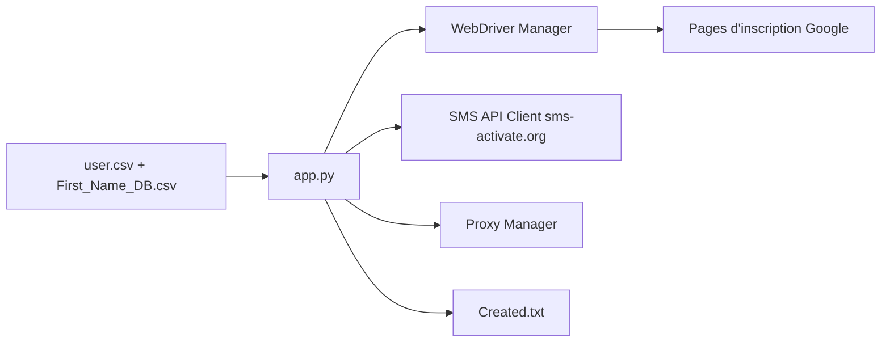

# ai-to-ai/Auto-Gmail-Creator

> Script Python Selenium qui crée des comptes Gmail en masse, avec vérification par SMS et proxys.

## Le problème
Créer de nombreux comptes Google à la main est long ; le script prétend l'automatiser malgré la détection anti-bot.

## Ce que ça fait vraiment
`app.py` lit ou génère des identités (`user.csv`, listes de prénoms et de noms), pilote Chrome ou Firefox via Selenium, loue un numéro chez sms-activate.org, applique un proxy SOCKS5 et écrit les comptes réussis dans `Created.txt`. L'auteur propose de vendre un webdriver furtif contre un café.

## Comment c'est branché


## Essayer
```bash
pip install -r requirements.txt
python app.py
```

## Coût et pièges
Il faut payer un service SMS et des proxys ; l'auteur cherche lui-même des fournisseurs fiables et bon marché. Environ cinq comptes par numéro selon le README. Aucun commit depuis septembre 2024 et aucune licence : rien ne t'autorise à réutiliser le code.

## Ce que ce n'est pas
Pas un outil d'automatisation générique : sa finalité est la création massive de comptes en contournant la détection, ce que les conditions de Google interdisent. Il contient un numéro de téléphone et des liens de contact personnels.

## Alternatives
Aucune alternative nommée dans le README.

## Pour toi
À ignorer : finalité contraire aux conditions d'usage de Google, sans licence, sans maintenance, et sans rapport avec un travail data/IA/MLOps.
