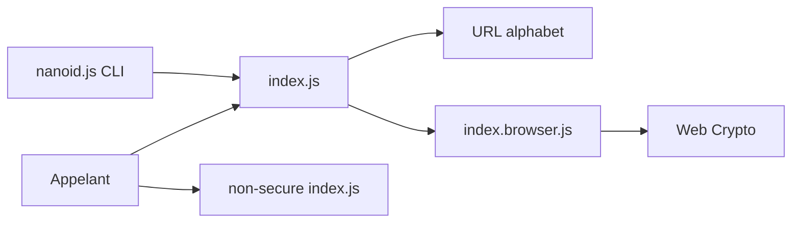

# ai/nanoid

> Générateur d'identifiants uniques, courts et sûrs pour URL, en JavaScript.

## Le problème
Les UUID font 36 caractères et `Math.random()` n'est pas sûr pour des identifiants.

## Ce que ça fait vraiment
Génère par défaut 21 caractères sur l'alphabet `A-Za-z0-9_-`, avec le générateur cryptographique du système (crypto Node, Web Crypto). Taille et alphabet configurables (`customAlphabet`, `customRandom`), version non sécurisée plus rapide à éviter sauf besoin, et une CLI. Sans dépendance, 127 octets minifiés d'après le README.

## Comment c'est branché


## Essayer
```bash
npm install nanoid
npx nanoid
npx nanoid --size 10
npx nanoid --alphabet abc --size 15
```

## Coût et pièges
Gratuit. L'alphabet doit contenir 1 à 256 symboles. Ne pas s'en servir pour la prop `key` de React. Sous React Native, un polyfill du générateur aléatoire est requis.

## Ce que ce n'est pas
Pas un identifiant ordonné dans le temps. L'ordre d'appel du générateur peut changer entre versions : pas de résultat reproductible avec une graine.

## Alternatives
- crypto.randomUUID : natif, moins rapide d'après le benchmark du README.
- uuid v4 : format standard de 36 caractères.
- @lukeed/uuid : cité dans le benchmark.

## Pour toi
Adopter pour générer des identifiants de run, de jeu de données ou de session dans du code JS ; petit et testé.

