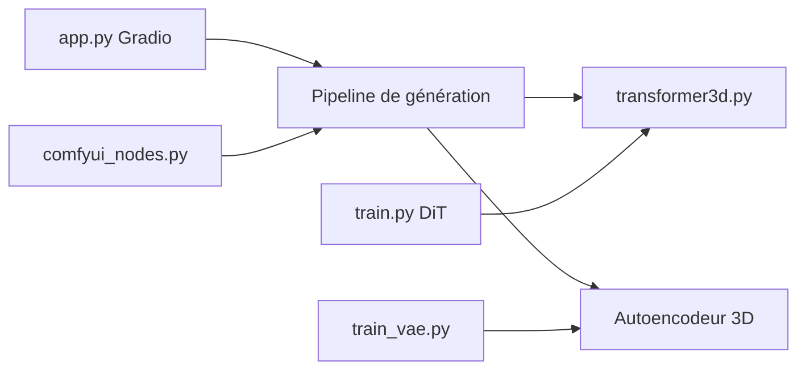

# aigc-apps/EasyAnimate

> Solution de bout en bout pour générer des vidéos longues en haute résolution avec des transformeurs de diffusion.

## Le problème
Générer et personnaliser des vidéos demande de chaîner prétraitement, VAE et DiT, avec des besoins de mémoire GPU élevés.

## Ce que ça fait vraiment
Génération texte, image ou vidéo vers vidéo (V5.1 : jusqu'à 1024x1024, 49 images, environ 6 s à 8 i/s), contrôles (Canny, pose, trajectoire, caméra), entraînement de LoRA et de DiT, entraînement optionnel d'un VAE vidéo, prétraitement et légendage des données, optimisation par récompense. Utilisable par interface Gradio, scripts Python ou ComfyUI ; modes d'économie mémoire par déchargement CPU ou quantification float8.

## Comment c'est branché


## Essayer
```bash
docker pull mybigpai-public-registry.cn-beijing.cr.aliyuncs.com/easycv/torch_cuda:easyanimate
git clone https://github.com/aigc-apps/EasyAnimate.git
sh scripts/train.sh
```
(Les poids sont à télécharger depuis Hugging Face ou ModelScope ; le README indique les lancements par `predict_t2v.py` et `app.py`.)

## Coût et pièges
Environ 60 Go de disque pour les poids. Le modèle 12B tient sur 16 Go seulement avec déchargement séquentiel, lent ; A10 24 Go : environ 120 s pour 384x672x25 images. Sur V100 ou 2080Ti, passer en float16.

## Ce que ce n'est pas
Pas un service en ligne. Dernier push en mars 2025 ; 98 issues ouvertes. Les anciennes versions V1 à V5 sont signalées comme obsolètes.

## Alternatives
Aucune alternative nommée dans le README (il cite CogVideo, Open-Sora, AnimateDiff et d'autres comme références de départ).

## Pour toi
À surveiller : référence pour générer ou affiner des vidéos en local, mais le matériel requis et le rythme ralenti du dépôt limitent l'intérêt.

