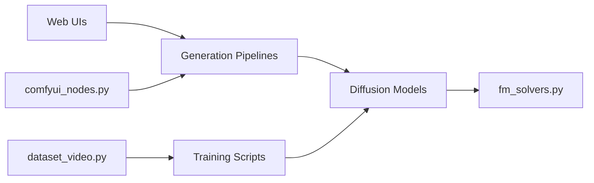

# aigc-apps/VideoX-Fun

> Boîte à outils pour générer images et vidéos avec des transformeurs de diffusion, et entraîner ses LoRA.

## Le problème
Utiliser et affiner les modèles vidéo récents (Wan, CogVideoX, Qwen-Image, Flux…) demande de rassembler pipelines, poids et scripts d'entraînement.

## Ce que ça fait vraiment
Pipelines de génération texte, image ou vidéo vers vidéo avec contrôle (Canny, profondeur, pose, caméra), interface Gradio, nœuds ComfyUI, prédiction multi-GPU (xfuser, Ulysses/Ring). Entraînement de modèles et de LoRA à partir d'un JSON de données, LoRA à récompense, modes d'économie de mémoire GPU (offload, qfloat8). Large catalogue de poids sur Hugging Face et ModelScope.

## Comment c'est branché


## Essayer
```bash
git clone https://github.com/aigc-apps/VideoX-Fun.git
cd VideoX-Fun
mkdir models/Diffusion_Transformer
python examples/cogvideox_fun/predict_t2v.py
sh scripts/train.sh
```

## Coût et pièges
GPU de 12 à 80 Go selon le modèle, environ 60 Go de disque pour les poids ; les poids se téléchargent à part.

## Ce que ce n'est pas
Pas un service hébergé : tout tourne chez toi. Les sorties peuvent présenter des artefacts ; le risque de deepfakes est signalé.

## Alternatives
Wan2.1 et Wan2.2, CogVideo, diffusers (cités dans les références).

## Pour toi
À surveiller : utile pour tester et affiner des modèles vidéo sur ton GPU, à condition d'avoir la mémoire et le disque.

