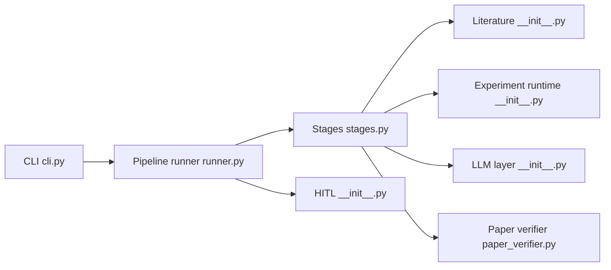

# aiming-lab/AutoResearchClaw

> Pipeline d'agents qui transforme un sujet de recherche en article LaTeX avec expériences exécutées.

## Le problème
Revue de littérature, conception d'expériences, exécution, analyse et rédaction prennent des semaines, avec risque de références inventées.

## Ce que ça fait vraiment
Pipeline de 23 étapes : cadrage, collecte OpenAlex/Semantic Scholar/arXiv, hypothèses par débat multi-agents, génération de code.
Expériences en sandbox local, Docker ou SSH, détection GPU, réparation automatique ; décision PROCEED/REFINE/PIVOT.
Rédaction en gabarits NeurIPS/ICLR/ICML, vérification des citations sur 4 niveaux, garde anti-fabrication.
Modes humain-dans-la-boucle (co-pilot, gate-only…), budgets de coût ; LLM via API compatible OpenAI ou agent ACP (Claude Code, Codex…).

## Comment c'est branché


## Essayer
```bash
git clone https://github.com/aiming-lab/AutoResearchClaw.git
cd AutoResearchClaw
pip install -e .
researchclaw setup
researchclaw init
researchclaw run --config config.arc.yaml --topic "Your research idea" --auto-approve
```

## Coût et pièges
Appels LLM facturés (budget configurable) ; Docker et LaTeX vérifiés par `setup`. GPU utile pour les expériences.

## Ce que ce n'est pas
Pas un garant de validité scientifique : les articles restent à relire. Dépôt très jeune (mars 2026).

## Alternatives
- AI Scientist (Sakana AI) : pionnier cité comme inspiration.
- AutoResearch (Andrej Karpathy) : automatisation de bout en bout, citée aussi.

## Pour toi
À surveiller : l'idée d'outiller revue de littérature et baselines est utile, mais le « un sujet, un article » demande un contrôle humain serré.
