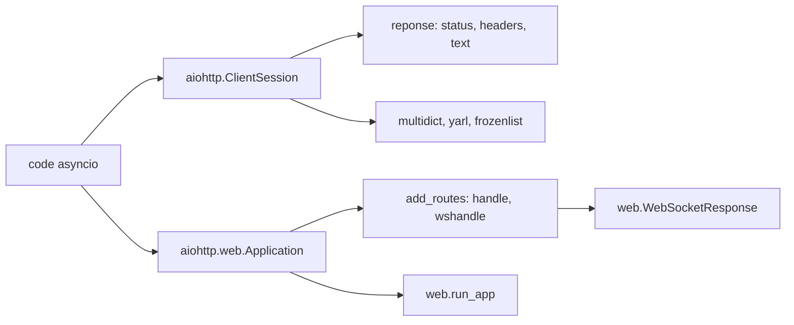

# aio-libs/aiohttp

> **Asynchronous HTTP client and server for Python, for anyone writing asyncio code.**

## The problem

Without it, speaking HTTP from `asyncio` code means either wrapping a synchronous library
such as `requests` — which the README names — or writing the protocol and WebSocket handling
yourself on top of asyncio transports. The README even links a page explaining "why we need
so many lines" for people arriving from `requests`.

## What it actually does

The README claims three things and nothing more. It covers **both the client and the server
side** of HTTP in one library. It handles **WebSockets on both sides**, the server example
showing the `async for msg in ws` loop with `text`, `binary` and `close` message types. And it
ships a **web server with middlewares and pluggable routing**, through `web.Application()` and
`app.add_routes([...])` with path patterns such as `/{name}`. On the client side everything
goes through `aiohttp.ClientSession()` used as a context manager, returning a response object
carrying `status`, `headers` and `text()`.

## How it is wired



Two independent entry paths start from the same package. The client path starts at
`ClientSession` and produces responses read with `await response.text()`. The server path
starts at `web.Application`, onto which handlers are attached via `add_routes` — a plain HTTP
handler and a WebSocket handler preparing a `web.WebSocketResponse` — then `web.run_app` runs
the whole thing. The README lists `multidict`, `yarl` and `frozenlist` as the shared base.

## Trying it

The README documents **no installation or run command** at all: it only gives Python code.
Here is the client example exactly as it appears in the README.

```python
import aiohttp
import asyncio

async def main():

    async with aiohttp.ClientSession() as session:
        async with session.get('https://python.org') as response:

            print("Status:", response.status)
            print("Content-type:", response.headers['content-type'])

            html = await response.text()
            print("Body:", html[:15], "...")

asyncio.run(main())
```

## Cost and traps

No cost: no API key, no third-party service, no account to create in anything the README
describes. The real trap is documentary — the README says neither how to install the package
nor which Python version is required, pushing everything else to
`https://aiohttp.readthedocs.io/`. You also pull three dependencies (`multidict`, `yarl`,
`frozenlist`) and, if you follow the README's own recommendation, add `aiodns` on top.

## What it is not

It is not a drop-in replacement for `requests`: the README explicitly links a page explaining
why the code is more verbose, and every usage assumes a running asyncio loop. It is not a
full-stack web framework either: no ORM, no templating, no authentication in what the README
describes — just routing, middlewares and WebSockets. And performance is not argued here; the
README simply points at the asyncio wiki's benchmark list.

## Alternatives

- `requests` — named in the README: synchronous, shorter to write, preferable outside asyncio.
- `Kludex/uvicorn` — an ASGI server: preferable when you want to run an existing ASGI app
  rather than write client and server in the same library.
- `sparckles/Robyn` — another Python web server: comparable on the server side only, with no
  client part.

## For you

For a data/AI/MLOps profile this is the brick to know as soon as you need to fan out hundreds
of API calls (inference, feature scraping, collection) without blocking: a reused
`ClientSession` is the right pattern. Adopt it, remembering the useful documentation lives on
readthedocs rather than in the repository.
