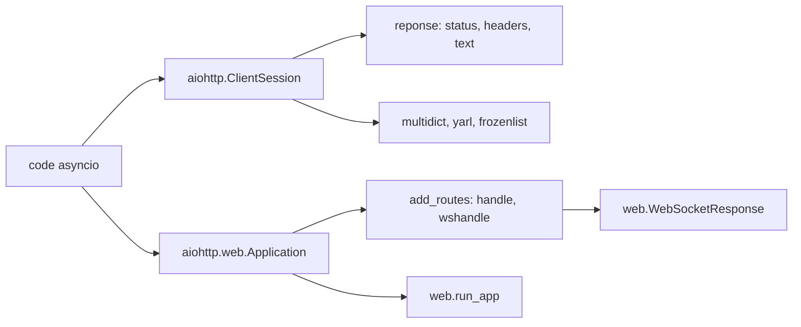

# aio-libs/aiohttp

> **Client et serveur HTTP asynchrones pour Python, pour qui écrit du code asyncio.**

## Le problème

Sans elle, parler HTTP depuis du code `asyncio` oblige à bricoler autour d'une bibliothèque
synchrone comme `requests`, citée par le README, ou à écrire soi-même le protocole et les
WebSockets au-dessus des transports bas niveau d'asyncio. Le README renvoie d'ailleurs à une
page expliquant « why we need so many lines » quand on arrive de `requests`.

## Ce que ça fait vraiment

Le README annonce trois choses, et rien de plus. Elle couvre le **côté client et le côté
serveur** du protocole HTTP dans la même bibliothèque. Elle gère les **WebSockets** des deux
côtés, l'exemple serveur montrant la boucle `async for msg in ws` avec les types `text`,
`binary` et `close`. Elle fournit un **serveur web avec middlewares et routage enfichable**,
via `web.Application()` et `app.add_routes([...])` avec des motifs de chemin comme `/{name}`.
Côté client, tout passe par `aiohttp.ClientSession()` utilisée en gestionnaire de contexte,
qui rend un objet réponse porteur de `status`, `headers` et `text()`.

## Comment c'est branché



Deux chemins d'entrée indépendants partent du même paquet. Le chemin client part de
`ClientSession`, qui produit les réponses lues avec `await response.text()`. Le chemin serveur
part de `web.Application`, à laquelle on accroche des handlers par `add_routes` — un handler
HTTP ordinaire et un handler WebSocket qui prépare une `web.WebSocketResponse` — puis
`web.run_app` fait tourner le tout. Les dépendances `multidict`, `yarl` et `frozenlist`
sont listées par le README comme socle commun.

## Essayer

Le README ne documente **aucune commande d'installation** ni d'exécution : il ne donne que du
code Python. Voici l'exemple client tel qu'il figure dans le README.

```python
import aiohttp
import asyncio

async def main():

    async with aiohttp.ClientSession() as session:
        async with session.get('https://python.org') as response:

            print("Status:", response.status)
            print("Content-type:", response.headers['content-type'])

            html = await response.text()
            print("Body:", html[:15], "...")

asyncio.run(main())
```

## Coût et pièges

Aucun coût : pas de clé d'API, pas de service tiers, pas de compte à créer dans ce que décrit
le README. Le vrai piège est documentaire : le README ne dit ni comment installer le paquet,
ni quelle version de Python est requise, et renvoie tout le reste vers
`https://aiohttp.readthedocs.io/`. Il faut aussi tirer trois dépendances (`multidict`, `yarl`,
`frozenlist`) et, si l'on suit la recommandation du README, ajouter `aiodns` en option.

## Ce que ce n'est pas

Ce n'est pas un remplaçant direct de `requests` : le README pointe explicitement une page
expliquant pourquoi le code est plus verbeux, et tout l'usage suppose une boucle asyncio déjà
en place. Ce n'est pas non plus un framework web complet façon Django : pas d'ORM, pas de
gabarits, pas d'authentification dans ce que le README décrit — juste routage, middlewares et
WebSockets. Enfin, les performances ne sont pas argumentées ici : le README se contente de
renvoyer vers la liste de benchmarks du wiki asyncio.

## Alternatives

- `requests` — nommé dans le README : synchrone, plus court à écrire, à préférer hors asyncio.
- `Kludex/uvicorn` — serveur ASGI : à préférer si l'on veut faire tourner une appli ASGI
  existante plutôt qu'écrire client et serveur dans la même bibliothèque.
- `sparckles/Robyn` — autre serveur web Python : comparable seulement côté serveur, aucune
  partie cliente.

## Pour toi

Pour un profil data/IA/MLOps, c'est la brique à connaître dès qu'il faut paralléliser des
centaines d'appels d'API (inférence, scraping de features, collecte) sans bloquer : la
`ClientSession` réutilisée est le bon pattern. Adopter, en gardant à l'esprit que la doc
utile est sur readthedocs, pas dans le dépôt.
