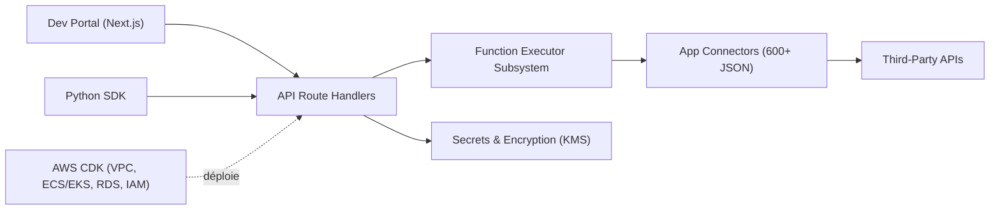

# aipotheosis-labs/aci

> Plateforme qui donne à des agents IA accès à 600+ outils via un serveur MCP unifié ou un SDK.

## Le problème
Chaque outil tiers (Google Calendar, Slack…) demande son propre flux OAuth et son client API. Multiplier ces outils dans le contexte du LLM le surcharge.

## Ce que ça fait vraiment
Un backend FastAPI expose des définitions d'apps et de fonctions (JSON) comme appels de fonction ou comme serveur MCP. Il gère l'authentification multi-tenant, les permissions en langage naturel, la découverte dynamique d'outils et les logs d'usage. Un portail Next.js sert à configurer projets et Playground. Le SDK Python appelle les mêmes endpoints.

## Comment c'est branché


## Essayer
```bash
# Le README renvoie aux README de chaque composant :
#   backend/README.md
#   frontend/README.md
# Aucune commande n'est donnée dans le README racine.
```

## Coût et pièges
Le service géré (aci.dev) est un SaaS ; l'auto-hébergement suppose backend, frontend et PostgreSQL, avec un déploiement AWS CDK décrit dans le code. Chaque intégration exige les identifiants OAuth du service tiers.

## Ce que ce n'est pas
Ce dépôt est la plateforme, pas le serveur MCP unifié (dépôt `aci-mcp` à part). Ce n'est pas un framework d'agents : il fournit les outils, pas la boucle de raisonnement.

## Alternatives
- aci-mcp : le serveur MCP unifié lui-même, si tu ne veux que ça.
- aci-python-sdk / aci-typescript-sdk : accès direct sans le portail.

## Pour toi
À surveiller : utile si tes agents doivent appeler beaucoup d'API SaaS avec OAuth par utilisateur, mais l'auto-hébergement complet (AWS, Postgres, KMS) est lourd pour un besoin modeste.
