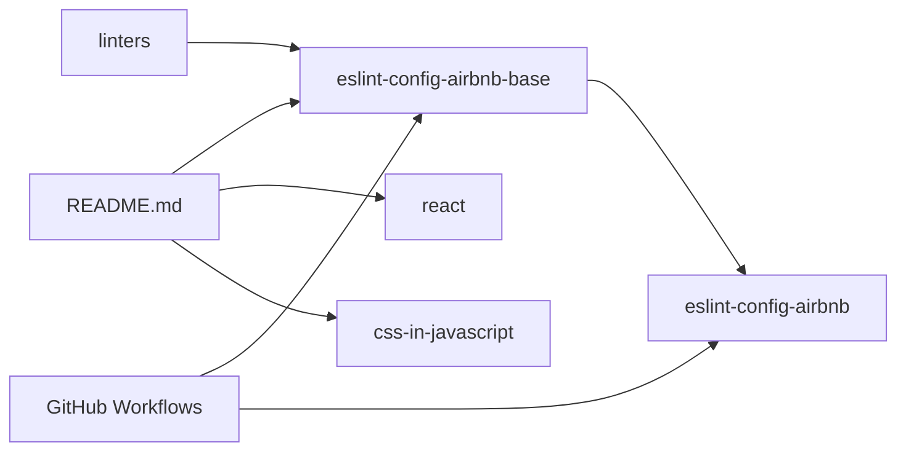

# airbnb/javascript

> Guide de style JavaScript d'Airbnb, règle par règle, doublé de configurations ESLint publiées.

## Le problème
Sans conventions partagées, une équipe JavaScript perd du temps en revues de code sur la forme (`var`, portée, objets, citations).

## Ce que ça fait vraiment
Le README énumère des règles numérotées (1.1 types primitifs, 2.1 `const` plutôt que `var`, 3.x objets…), chacune avec un exemple bad/good, une justification (« Why? ») et la règle ESLint correspondante (`prefer-const`, `no-var`, `object-shorthand`…).
Le dépôt publie deux paquets : `eslint-config-airbnb-base` et `eslint-config-airbnb` (qui l'étend avec React), plus des guides annexes React et CSS-in-JavaScript.
Le guide suppose Babel (`babel-preset-airbnb`) et des polyfills (`airbnb-browser-shims`).

## Comment c'est branché

## Essayer
Aucune commande documentée dans la partie lue du README.

## Coût et pièges
Gratuit, MIT. Le guide suppose Babel et des polyfills : un projet sans eux ne s'y aligne pas tel quel.

## Ce que ce n'est pas
Pas un formateur de code : des règles et des configs ESLint, rien pour TypeScript dans la partie lue. La version ES5 est marquée dépréciée.

## Alternatives
Aucune alternative nommée dans le README (seulement les autres guides d'Airbnb : React, CSS & Sass, Ruby).

## Pour toi
Hors de ton périmètre data / IA : à ignorer, sauf si tu écris beaucoup de front JavaScript.
