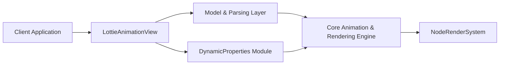

# airbnb/lottie-ios

> Bibliothèque Apple qui rend nativement des animations vectorielles JSON exportées depuis After Effects.

## Le problème
Recréer à la main en code les animations dessinées par les designers est long et divergent du dessin original.

## Ce que ça fait vraiment
Charge des animations au format bodymovin JSON et les rend en temps réel sur iOS, macOS, tvOS et visionOS, en s'appuyant sur les couches CALayer/CAAnimation d'Apple et un système de rendu par nœuds. Lecture, boucle, vitesse, inversion, plage partielle ; propriétés modifiables à l'exécution (couleur, position). Un cache LRU et la lecture de fichiers `.lottie` compressés sont inclus.

## Comment c'est branché


## Essayer
```swift
.package(url: "https://github.com/airbnb/lottie-spm.git", from: "4.6.1")
```
```ruby
pod 'lottie-ios'
```

## Coût et pièges
Gratuit. Le dépôt principal pèse plus de 300 Mo ; le README conseille le dépôt `lottie-spm` pour Swift Package Manager. Le README indique ne collecter aucune donnée.

## Ce que ce n'est pas
Ce n'est pas un outil de création d'animations : il joue des fichiers exportés. Les versions Android et Web sont dans d'autres dépôts.

## Alternatives
- Aucune alternative nommée dans le README.

## Pour toi
Ignorer : bibliothèque d'interface mobile Apple, sans rapport avec la data, l'IA ou le MLOps.

