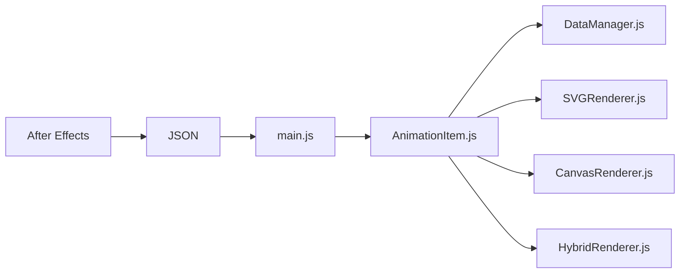

# airbnb/lottie-web

> Lecteur web d'animations After Effects exportées en JSON, pour designers et développeurs front-end.

## Le problème
Faire livrer des animations de designers sans que le développeur les refasse à la main.

## Ce que ça fait vraiment
Un plugin Bodymovin exporte une composition After Effects en JSON ; le lecteur lottie-web la rend en SVG, canvas ou HTML dans une page. L'API permet play, pause, vitesse, segments, événements, et un chargement par attributs HTML (classe « lottie »). Un traitement par worker est optionnel.

## Comment c'est branché


## Essayer
```bash
npm install lottie-web
```
```js
lottie.loadAnimation({
  container: element,
  renderer: 'svg',
  loop: true,
  autoplay: true,
  path: 'data.json'
});
```

## Coût et pièges
Le plugin d'export suppose After Effects, logiciel payant non fourni. Le rendu est en temps réel : trop de nœuds ralentit. Dernier push en septembre 2025.

## Ce que ce n'est pas
Pas un outil de création d'animation. Le README parle aussi de mobile mais ce dépôt est le lecteur web.

## Alternatives
Aucune alternative nommée dans le README.

## Pour toi
Surveiller : utile seulement pour animer un tableau de bord ou une démo ; la dépendance à After Effects limite l'intérêt hors design.

