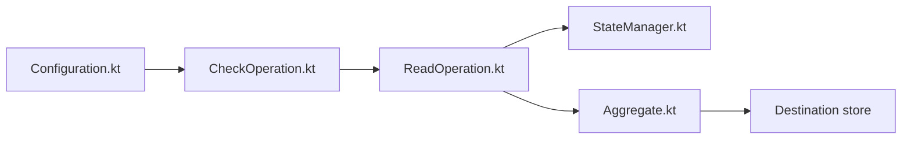

# airbytehq/airbyte

> Plateforme ELT open source déplaçant des données d'APIs et bases vers entrepôts, lacs et agents IA.

## Le problème
Écrire et maintenir un connecteur par source et par destination ne passe pas à l'échelle.

## Ce que ça fait vraiment
Fournit plus de 600 connecteurs. Une synchronisation vérifie la source, découvre les flux, lit enregistrements et états, puis la destination parse, agrège par lots et écrit. Un Connector Builder sans code et un CDK bas code permettent de créer des connecteurs. Un Agent SDK (`airbyte-agent-sdk`) expose des connecteurs comme outils LLM.

## Comment c'est branché


## Essayer
```bash
uv pip install airbyte-agent-sdk
```
Le déploiement ELT renvoie à la documentation (non détaillé dans le README).

## Coût et pièges
Open Source à héberger soi-même, ou Airbyte Cloud payant ; Enterprise ajoute des fonctions de sécurité. Licence présente mais non identifiée par GitHub.

## Ce que ce n'est pas
Ce n'est pas un outil de transformation : il déplace les données. Le README n'indique pas les ressources nécessaires.

## Alternatives
Non documenté : le README cite seulement des orchestrateurs compatibles (Airflow, Dagster, Kestra).

## Pour toi
Adopter pour alimenter un entrepôt ou un pipeline ML : grande bibliothèque de connecteurs ; vérifie la licence.

