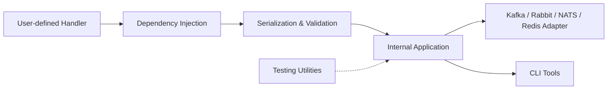

# airtai/faststream

> Framework Python asynchrone pour écrire producteurs et consommateurs Kafka, RabbitMQ, NATS, Redis ou MQTT.

## Le problème
Chaque service de messagerie réécrit à la main sérialisation, cycle de vie, acquittements, docs et tests contre un vrai broker.

## Ce que ça fait vraiment
Des décorateurs `@broker.subscriber` et `@broker.publisher` façon FastAPI, validation Pydantic ou Msgspec, injection de dépendances. Génère une spec AsyncAPI depuis le code. Un `TestBroker` en mémoire permet de tester sans conteneur. Client fin : le client natif du broker reste accessible. Pas de retries ni d'orchestration métier fournis.

## Comment c'est branché


## Essayer
```bash
pip install 'faststream[kafka]'
pip install "faststream[cli]"
faststream run basic:app
faststream run basic:app --reload
```

## Coût et pièges
Gratuit ; il faut un broker en fonctionnement. Le plugin FastAPI est déprécié (paquet faststream_fastapi). Version 1.0 pas encore sortie : des changements de rupture restent possibles.

## Ce que ce n'est pas
Ni une couche d'abstraction unique sur tous les brokers, ni un moteur de retries ou de workflows.

## Alternatives
- faststream_fastapi : pour l'intégration FastAPI désormais externalisée.

## Pour toi
À adopter pour des pipelines data/ML pilotés par événements : API réduite, tests sans broker et spec AsyncAPI gratuite.
