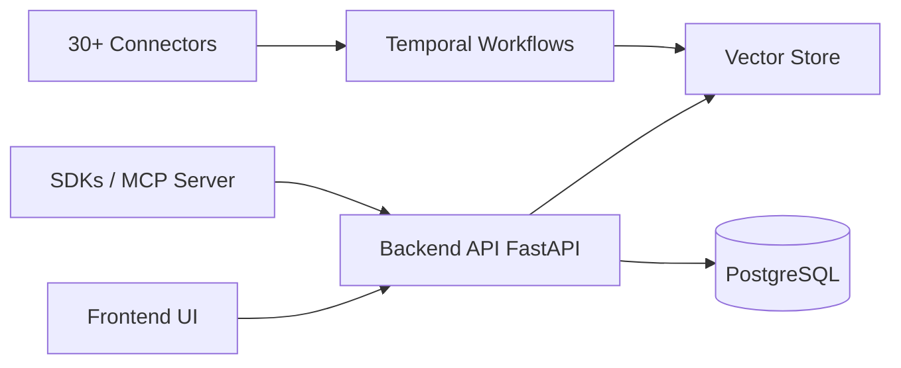

# airweave-ai/airweave

> Couche de retrieval qui synchronise applications et bases pour les exposer aux agents IA.

## Le problème
Chaque agent reconstruit ses propres pipelines fragiles d'authentification, synchronisation et indexation des sources.

## Ce que ça fait vraiment
Connecteurs vers 50+ applications, synchronisation continue orchestrée par Temporal, indexation vectorielle.
Recherche unifiée exposée par SDK Python/TS, API REST, CLI et serveur MCP.
Backend FastAPI, PostgreSQL pour les métadonnées, Vespa (ou Qdrant selon l'analyse du code) pour les vecteurs.
Le dépôt est archivé.

## Comment c'est branché


## Essayer
```bash
git clone https://github.com/airweave-ai/airweave.git
cd airweave
./start.sh
pip install airweave-sdk
pip install airweave-cli
airweave search "quarterly revenue figures" --collection finance-data
```

## Coût et pièges
Auto-hébergement gratuit via Docker ; version cloud app.airweave.ai.
Dépôt archivé : plus de correctifs ni de connecteurs mis à jour.

## Ce que ce n'est pas
Pas un projet vivant : ne pas bâtir dessus.
Pas un simple vector store : une plateforme complète à opérer.

## Alternatives
Aucune alternative nommée dans le README.

## Pour toi
À ignorer : l'idée de retrieval unifié pour agents est bonne, mais un dépôt archivé est un risque inutile.
