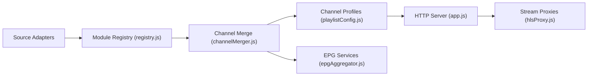

# akiralereal/iptv

> Serveur auto-hébergé qui agrège des sources de chaînes IPTV et sert playlists M3U et guide EPG.

## Le problème
Regrouper des sources de télévision dispersées (plateformes, télés régionales, abonnements M3U) en une liste propre et adaptée à chaque lecteur.

## Ce que ça fait vraiment
Application Node qui lance des modules d'extraction par plateforme (CCTV, Migu, Bilibili, Huya, Douyu, télés régionales chinoises, etc.), fusionne et dédoublonne les chaînes, gère profils, jetons d'utilisateur et EPG, puis sert M3U, TXT et XMLTV via des proxys HLS/FLV. Un navigateur Chromium sans interface sert à l'extraction de certaines sources. Interface d'administration en navigateur.

## Comment c'est branché


## Essayer
```bash
docker compose up -d
docker compose pull && docker compose up -d
node app.js
```
Avec le `docker-compose.yml` du README (image `akiralereal/iptv:latest`, port 1905, volume `./data`).

## Coût et pièges
Gratuit. Le README insiste : les adresses publiques ne valent pas droit de diffusion ; l'utilisateur est responsable des sources. Certaines chaînes exigent des cookies de comptes personnels et Chromium consomme 200 à 400 Mo chacun.

## Ce que ce n'est pas
Ne fournit aucun contenu sous licence : il agrège des liens tiers. README en chinois, contenu ciblant des réseaux de Chine continentale.

## Alternatives
Aucune alternative nommée dans le README.

## Pour toi
À ignorer : utilitaire de télévision sans rapport avec data/IA/MLOps, avec des risques de droits d'auteur sur les sources.

