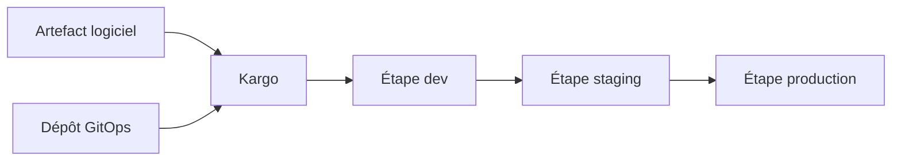

# akuity/kargo

> Outil GitOps qui automatise la promotion d'artefacts logiciels entre les étapes de leur cycle de vie.

## Le problème
Faire passer une image ou un chart de dev à staging puis production se fait à la main, commit après commit.
Chaque étape est une occasion d'erreur.

## Ce que ça fait vraiment
Le README disponible est très court et largement tronqué : il ne décrit que le principe général.
Kargo s'appuie sur les principes GitOps pour gérer et automatiser la promotion des artefacts logiciels.
La promotion couvre les nombreuses étapes du cycle de vie d'un artefact, sans que le détail soit donné ici.
Le reste renvoie à la documentation, à un tutoriel Quickstart et à une conférence GitOpsCon EU 2024.

## Comment c'est branché

## Essayer
Aucune commande documentée dans le README : il renvoie au tutoriel Quickstart.

## Coût et pièges
Le projet est porté par Akuity, éditeur commercial : vérifier où s'arrête la version ouverte.
Suppose une chaîne GitOps déjà en place, donc un cluster et un dépôt de manifestes.

## Ce que ce n'est pas
Pas un moteur de déploiement : il pilote la promotion, l'application reste au GitOps.
Pas documenté ici — le README est trop pauvre pour en tirer une décision.
Pas un outil de CI.

## Alternatives
Aucune alternative nommée dans le README.

## Pour toi
Matière insuffisante ; à rouvrir avec la vraie documentation si tu montes une chaîne GitOps.
