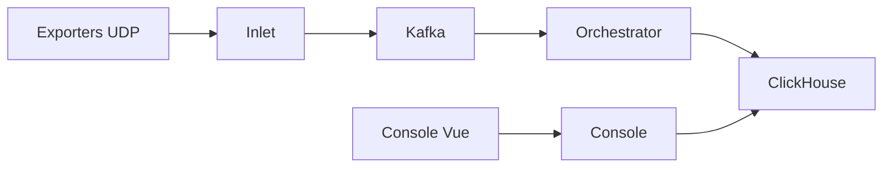

# akvorado/akvorado

> Collecteur et visualiseur de flux réseau NetFlow, IPFIX et sFlow, pour équipes réseau.

## Le problème
Comprendre qui consomme la bande passante sur un réseau demande de collecter, enrichir et interroger des flux bruts.

## Ce que ce n'est pas
Le README fourni ne contient que la section d'aide : il n'explique pas le produit. Ce qui suit vient de l'architecture d'après le code.

## Ce que ça fait vraiment
Le service `inlet` reçoit les flux UDP, les décode, les enrichit (SNMP, GNMI, statique, BMP/BGP, géolocalisation IPinfo ou MaxMind) et les publie dans Kafka. L'`orchestrator` les consomme et écrit dans ClickHouse. La `console` (backend Go, front Vue) interroge ClickHouse. Un `demo-exporter` génère de faux flux.

## Comment c'est branché


## Essayer
```bash
akvorado version | head -2
```
Seule commande présente dans le README (diagnostic de version). Installation : voir la doc embarquée dans la console.

## Coût et pièges
Infrastructure Kafka + ClickHouse à héberger. Enrichissement géo via IPinfo.io possible (service tiers). Licence AGPL-3.0.

## Alternatives
Aucune alternative nommée dans le README.

## Pour toi
À surveiller : pipeline Kafka → ClickHouse instructif et solide, mais spécialisé réseau ; README trop maigre pour trancher plus.

