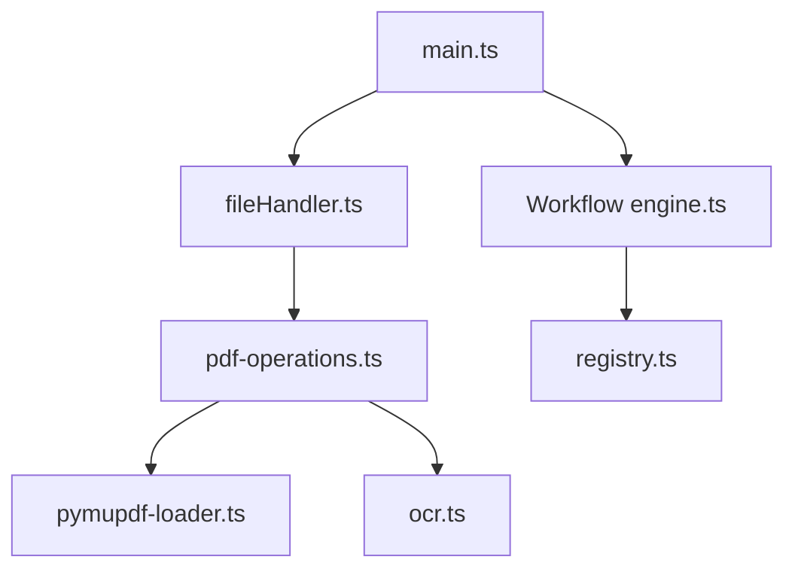

# alam00000/bentopdf

> Boîte à outils PDF qui tourne entièrement dans le navigateur, auto-hébergeable, avec plus de 50 outils.

## Le problème
Les sites PDF en ligne demandent d'envoyer ses fichiers, ce qui est exclu pour des documents sensibles.

## Ce que ça fait vraiment
Il fusionne, découpe, édite, remplit des formulaires, signe (X.509), expurge, compresse, fait de l'OCR, convertit depuis et vers Office, images et e-books.
Tout le traitement se fait dans le navigateur grâce à des modules WASM : PyMuPDF, Ghostscript, CPDF, LibreOffice, Tesseract.
Un éditeur visuel permet d'enchaîner les traitements en pipeline.
Il s'héberge en statique ou en Docker, avec un mode air-gapped scripté (`prepare-airgap.sh`).

## Comment c'est branché


## Essayer
```bash
docker run -p 3000:8080 ghcr.io/alam00000/bentopdf-simple:latest
npm install
npm run build
npm run dev
bash scripts/prepare-airgap.sh
```

## Coût et pièges
La licence est AGPL-3.0, ou une licence commerciale à 79 $ pour un usage fermé. Par défaut, les WASM se chargent depuis jsDelivr ; en réseau isolé, il faut les héberger soi-même.

## Ce que ce n'est pas
Ce n'est pas une bibliothèque PDF pour tes scripts Python. La signature numérique exige un proxy CORS (Cloudflare Worker).

## Alternatives
Le README ne nomme aucun dépôt alternatif. Il cite Kura et Hyper Compress, du même éditeur.

## Pour toi
À surveiller : pratique à installer en interne pour les PDF sensibles de l'équipe, mais l'AGPL et les CDN par défaut sont à valider avec la DSI.
