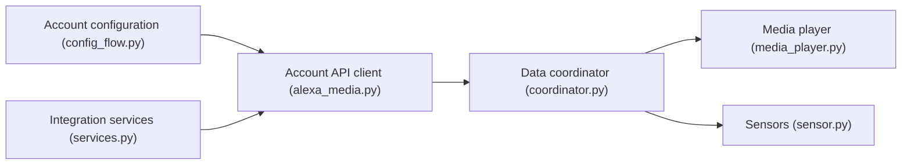

# alandtse/alexa_media_player

> Intégration Home Assistant pour piloter les appareils Amazon Echo via l'API Alexa non officielle.

## Le problème
Faire apparaître les Echo comme lecteurs multimédia dans Home Assistant.

## Ce que ça fait vraiment
- Lecture/pause/stop, piste suivante/précédente, volume.
- Remonte titre, artiste, album et pochette.
- Le code expose aussi capteurs, interrupteurs, lumières, alarmes, notifications et diagnostics.
- Installation et configuration : renvoyées au wiki.

## Comment c'est branché

## Essayer
Aucune commande documentée dans le README : voir le wiki.

## Coût et pièges
Compte Amazon requis. Le README prévient qu'Amazon peut couper l'accès à tout moment, l'API étant imitée de l'app Alexa.

## Ce que ce n'est pas
Pas une API officielle ni un service garanti. Pas un outil de développement IA.

## Alternatives
Aucune alternative nommée dans le README.

## Pour toi
À ignorer : domotique, sans lien avec data/IA/MLOps, et dépendante d'une API Amazon non supportée.

