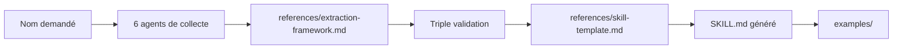

# alchaincyf/nuwa-skill

> Skill d'agent qui distille la façon de penser d'une personnalité publique en un skill réutilisable.

## Le problème
Obtenir le point de vue d'un expert (Munger, Feynman, Jobs) dans un agent exige de compiler ses écrits et interviews à la main, et un simple jeu de rôle imite le ton sans le raisonnement.

## Ce que ça fait vraiment
À partir d'un nom, le skill lance six agents de collecte (livres, interviews, réseaux, critiques, décisions, chronologie), puis retient un modèle mental s'il apparaît dans au moins deux domaines, prédit une position nouvelle et n'est pas banal. Il écrit un SKILL.md avec 3 à 7 modèles mentaux, des heuristiques, un style d'expression et des limites déclarées. Le dépôt embarque 13 personnalités et un skill thématique, avec leurs données de recherche.

## Comment c'est branché


## Essayer
```bash
npx skills add alchaincyf/nuwa-skill
git clone https://github.com/alchaincyf/nuwa-skill <chemin du dossier skills>
```

## Coût et pièges
Le skill consomme les appels du modèle de l'agent hôte (clé ou abonnement à ta charge). Les notes de fidélité (A, 89 à 97) sont attribuées par l'auteur avec un test à double agent, non vérifiées ici. Le README est en chinois, avec une section anglaise réduite.

## Ce que ce n'est pas
Ce n'est pas la pensée réelle des personnes : c'est une reconstruction à partir d'informations publiques, à un instant donné, sans intuition ni changement d'avis. Le fichier SKILL.md n'accepte pas de PR externes.

## Alternatives
- colleague-skill : cité comme précurseur, distille un collègue plutôt qu'une personnalité publique.

## Pour toi
À surveiller : la méthode d'extraction est intéressante à lire pour construire tes propres skills, mais les personas restent des approximations à ne pas prendre pour des avis d'experts.

