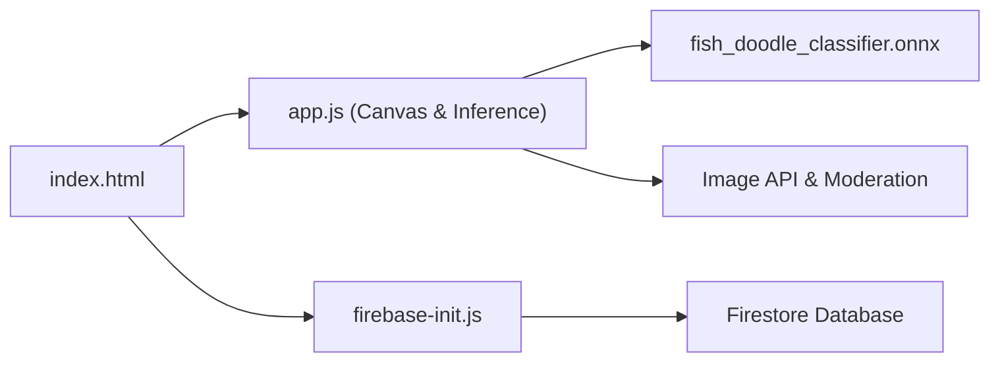

# aldenhallak/fishes

> Site de dessin de poissons validés par un réseau de neurones dans le navigateur, avec vote et aquarium partagé.

## Le problème
Un jeu de dessin collaboratif a besoin de filtrer les dessins hors sujet sans envoyer chaque trait à un serveur.

## Ce que ça fait vraiment
Le front statique (HTML/JS) fait tourner un classifieur ONNX via ONNX Runtime Web pendant le dessin. Les fonctions de vote, profils, aquariums personnels et modération passent par Firebase/Firestore. Un backend serverless séparé (fish-be) traite les images, et fish-trainer entraîne le modèle PyTorch. Le README dit que ~80 % du code est généré par IA.

## Comment c'est branché


## Essayer
```bash
# Aucune commande documentée. Étapes du README : placer fish_doodle_classifier.onnx dans assets/models/,
# configurer src/js/firebase-init.js, déployer le site statique (Vercel, Netlify, Firebase Hosting).
```

## Coût et pièges
Nécessite Firebase, un backend fish-be déployé (Cloud Run) et le modèle ONNX, qui vient d'un autre dépôt. Sans licence, réutilisation non autorisée.

## Ce que ce n'est pas
Pas une bibliothèque réutilisable : un site de démonstration. Le backend et l'entraînement sont dans d'autres dépôts.

## Alternatives
Aucune alternative nommée dans le README.

## Pour toi
Ignorer : exemple sympathique d'inférence ONNX côté navigateur, mais sans licence et incomplet sans les dépôts liés.
