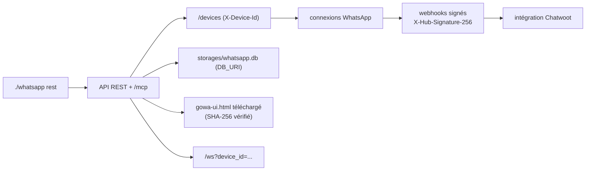

# aldinokemal/go-whatsapp-web-multidevice

> Passerelle Go qui expose plusieurs comptes WhatsApp en API REST, webhooks et serveur MCP.

## Le problème
Automatiser l'envoi et la réception de messages WhatsApp depuis un backend n'a pas d'API officielle
accessible ; gérer plusieurs comptes dans un même processus l'est encore moins.

## Ce que ça fait vraiment
`./whatsapp rest` sert à la fois l'API REST et le serveur MCP sur `/mcp` — ils sont unifiés depuis
la v9. Plusieurs appareils cohabitent dans une instance : les endpoints `/devices` les gèrent, et
tout appel scopé exige un en-tête `X-Device-Id` ou un paramètre `device_id`. Envoie messages,
statuts, stickers (conversion automatique en WebP 512×512), mentions dont `@everyone`, avec
compression d'images et de vidéos. Les webhooks portent un `device_id` de premier niveau, une
signature HMAC-SHA-256 dans `X-Hub-Signature-256`, un filtrage par type d'événement et par JID, et
peuvent être définis par appareil. Intégration Chatwoot avec import d'historique. Le tableau de bord
n'est plus dans le dépôt : il est téléchargé au démarrage, vérifié par empreinte SHA-256 et servi sur `/`.

## Comment c'est branché


## Essayer
```bash
./whatsapp rest
./whatsapp --help
cp src/.env.example src/.env
brew install ffmpeg webp
sudo apt update && sudo apt install ffmpeg webp
export CGO_CFLAGS_ALLOW="-Xpreprocessor"
```

## Coût et pièges
Gratuit mais dépend d'un service qu'on ne contrôle pas : un compte WhatsApp lié, avec le risque de
bannissement que le README n'évoque pas. FFmpeg et libwebp obligatoires, Go 1.26+ pour compiler.
`DB_KEYS_URI` en mémoire fait perdre l'état de session au redémarrage. `--webhook-insecure-skip-verify`
désactive la vérification TLS : réservé au développement. Le secret de webhook par défaut est `secret`.

## Ce que ce n'est pas
Pas une API officielle WhatsApp ni la Business API. Pas une interface : le tableau de bord vit dans
un autre dépôt et est récupéré au démarrage — un point de chaîne d'approvisionnement à épingler via
`APP_UI_ASSET_SHA256`. Les ruptures v6→v9 sont nombreuses : mode `rest` obligatoire, MCP fusionné,
scoping par appareil imposé.

## Alternatives
Aucune alternative nommée : `gowa-ui` et Chatwoot sont des compléments, pas des remplaçants.

## Pour toi
L'endpoint MCP en fait un canal d'agent intéressant ; à isoler du réseau et à ne pas brancher en prod.
