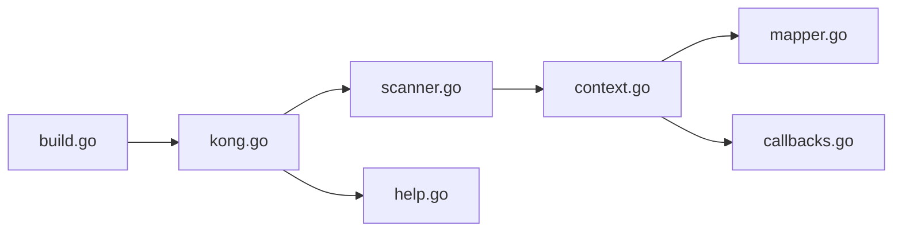

# alecthomas/kong

> Analyseur de ligne de commande Go : la structure de la CLI se décrit par des structs annotées.

## Le problème
Écrire des CLI imbriquées en Go avec les paquets standards est verbeux et répétitif.

## Ce que ça fait vraiment
Construit un modèle de commandes à partir d'une struct et de ses tags, analyse les arguments, décode les valeurs (durées, fichiers, URL, maps, slices), valide, puis appelle `Run()` sur la commande choisie. Aide contextuelle générée, hooks, plugins, commandes dynamiques, chargement de config (YAML, HCL, TOML, JSON), injection de dépendances. Version 1.0.0 publiée.

## Comment c'est branché


## Essayer
```go
var CLI struct {
  Rm struct {
    Force     bool `help:"Force removal."`
    Paths []string `arg:"" name:"path" help:"Paths to remove." type:"path"`
  } `cmd:"" help:"Remove files."`
}

func main() {
  ctx := kong.Parse(&CLI)
}
```

## Coût et pièges
Gratuit. Un changement cassant (#436) accompagne la 1.0. Le mode « switch sur la chaîne de commande » est fragile si la structure évolue.

## Ce que ce n'est pas
Pas un framework d'application complet : il ne gère que la ligne de commande.

## Alternatives
Aucune citée dans le README.

## Pour toi
Bon choix pour écrire un outil Go d'infra ou de MLOps avec sous-commandes ; sinon sans objet : adopter dans ce cas.

