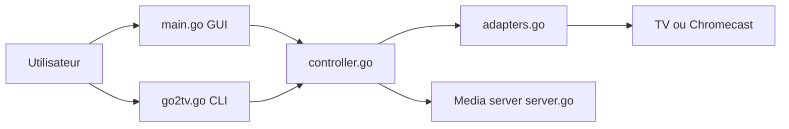

# alexballas/go2tv

> Envoie des vidéos, musiques et images locales vers une Smart TV ou un Chromecast.

## Le problème
Lire un fichier local sur la télévision oblige à passer par une clé USB ou un serveur multimédia.

## Ce que ça fait vraiment
Découvre les appareils DLNA/UPnP et Chromecast du réseau, sert le fichier en HTTP, transcode via FFmpeg si besoin, gère sous-titres, playlists, seek, flux RTMP (OBS) et diffusion du bureau. Interfaces : GUI, CLI et interface web en mode serveur.

## Comment c'est branché


## Essayer
```bash
brew install --cask go2tv
go2tv -l
go2tv -v movie.mkv -s movie.srt -tc -t http://192.168.1.100:8060/
go2tv -server -media-root /path/to/Media
```

## Coût et pièges
Gratuit. FFmpeg pour le transcodage. Le mode LAN du Web UI est en HTTP sans TLS. Ports UDP 3339-3438 et TCP 3500-4499 à ouvrir. Récepteur Chromecast hébergé par l'auteur.

## Ce que ce n'est pas
Pas un serveur multimédia avec bibliothèque indexée.

## Alternatives
Aucune alternative citée ; un serveur MCP compagnon, mcp-beam, utilise le même cœur.

## Pour toi
À ignorer : outil grand public bien fait mais sans lien avec data, IA ou MLOps.

