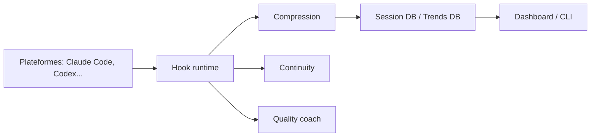

# alexgreensh/token-optimizer

> Plugin qui réduit les tokens gaspillés par les assistants de code et sauvegarde le contexte entre sessions.

## Le problème
Les assistants de code brûlent des tokens en relectures, sorties verbeuses et configs gonflées, et perdent le contexte à chaque compaction.

## Ce que ça fait vraiment
Des hooks interceptent les Read et Bash avant qu'ils n'entrent dans le contexte : diff sur relecture, squelette de fichier, sorties condensées, gros résultats archivés sur disque et récupérables (`expand`). Il checkpointe avant la compaction et restaure après. Tout est stocké dans deux bases SQLite locales, avec un tableau de bord HTML. Le README annonce aucune télémétrie ni appel réseau.

## Comment c'est branché


## Essayer
```bash
/plugin marketplace add alexgreensh/token-optimizer
/plugin install token-optimizer@alexgreensh-token-optimizer
```
Puis `/token-optimizer` dans Claude Code.

## Coût et pièges
Gratuit pour usage perso, recherche et petites équipes (moins de 5 personnes ou 20 k$/mois) ; licence commerciale au-delà. Les gains chiffrés sont ceux de l'auteur, une partie estimée et non mesurée. Windows : plugin uniquement.

## Ce que ce n'est pas
Pas un logiciel sous licence libre standard : licence non identifiée par GitHub, avec conditions commerciales. Pas un outil de facturation API.

## Alternatives
- Headroom, RTK, JFrog Boost, context-mode : cités en tableau comparatif (compression de sorties surtout).

## Pour toi
Surveiller : intéressant si tu utilises Claude Code intensément, mais licence à clauses commerciales et mainteneur unique.
