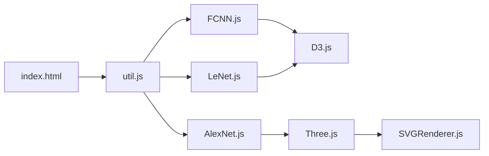

# alexlenail/NN-SVG

> Outil web qui dessine des schémas de réseaux de neurones paramétrables et les exporte en SVG.

## Le problème
Les figures d'architecture pour articles ou slides se dessinent à la main, lentement, à chaque changement de couche.

## Ce que ça fait vraiment
Trois styles : réseau entièrement connecté, CNN façon LeNet (D3), réseau profond façon AlexNet (Three.js).
Tailles, couleurs et disposition réglables par paramètres.
Export en SVG pour articles ou pages web ; site statique, tout tourne dans le navigateur.

## Comment c'est branché

## Essayer
Aucune commande dans le README : l'outil s'utilise dans le navigateur.

## Coût et pièges
Gratuit, rien à installer. README court : paramètres et limites non détaillés.

## Ce que ce n'est pas
Pas un générateur depuis un modèle PyTorch ou Keras : on saisit l'architecture à la main. Ne couvre pas les transformers.

## Alternatives
- vdumoulin/conv_arithmetic : illustrations des convolutions.
- TensorSpace : visualisation 3D interactive de réseaux.

## Pour toi
À adopter pour les supports de présentation : figures propres de MLP ou CNN en deux minutes, sans rien installer.
