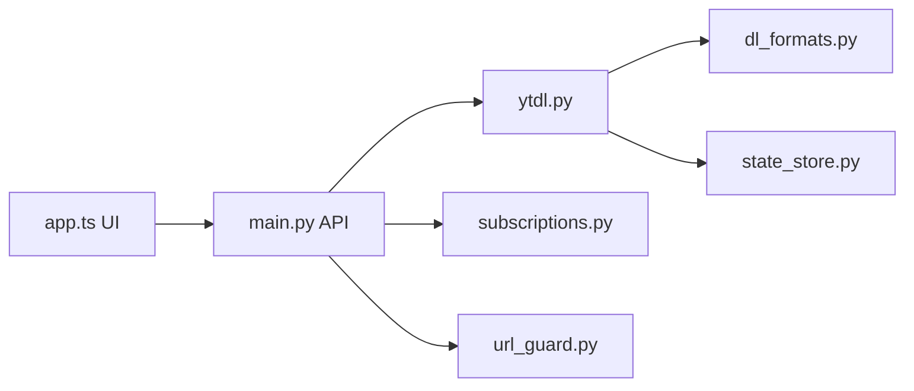

# alexta69/metube

> Interface web auto-hébergée pour yt-dlp, afin de télécharger vidéos, audios et playlists.

## Le problème
yt-dlp est un outil en ligne de commande ; piloter des téléchargements depuis plusieurs appareils demande une interface.

## Ce que ça fait vraiment
Interface Angular qui envoie des URL à une API Python ; le moteur yt-dlp télécharge vidéos, audios, sous-titres, miniatures, playlists et chaînes, avec file persistante, abonnements surveillés périodiquement, gabarits de noms, préréglages d'options, cookies téléversables. Mise à jour automatique des images Docker au rythme de yt-dlp. Protection SSRF des adresses privées, activée par défaut.

## Comment c'est branché


## Essayer
```bash
docker run -d -p 8081:8081 -v /path/to/downloads:/downloads ghcr.io/alexta69/metube
```

## Coût et pièges
Gratuit, licence AGPL-3.0. Autoriser les options yt-dlp par téléchargement (`ALLOW_YTDL_OPTIONS_OVERRIDES`) peut permettre d'exécuter des commandes : réservé aux environnements de confiance. `CORS_ALLOWED_ORIGINS=*` à manier avec précaution. Respecter les conditions des sites visés.

## Ce que ce n'est pas
Pas un gestionnaire de bibliothèque : gestion et étiquetage post-téléchargement hors périmètre, assumé.

## Alternatives
beets, MusicBrainz Picard, Lidarr : étiquetage et organisation de la musique téléchargée.

## Pour toi
Utile pour constituer un corpus audio/vidéo (transcription, jeux de données) sur un serveur perso ; déploiement trivial, à adopter avec soin juridique.

