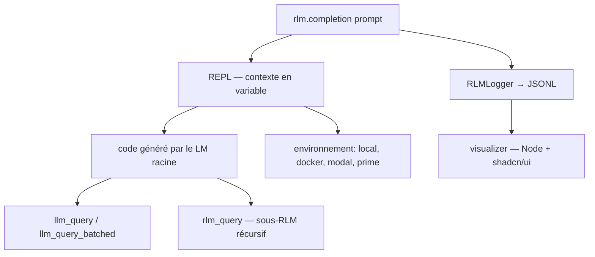

# alexzhang13/rlm

> Modèles de langage récursifs : le contexte devient une variable dans un REPL.

## Le problème
Un contexte très long ne tient pas dans une fenêtre, et le découper à la main perd la structure.
Les sous-agents passés en JSON tool-calling rigidifient ce qui devrait être du code.

## Ce que ça fait vraiment
Il remplace `llm.completion(prompt, model)` par `rlm.completion(prompt, model)` : le contexte est déposé comme variable dans un REPL que le modèle inspecte et décompose lui-même.
Les sous-appels sont des fonctions dans le code (`llm_query`, `llm_query_batched`, `rlm_query`, `rlm_query_batched`), pas des outils JSON, avec parallélisme borné par `max_concurrent_subcalls`.
Sept environnements REPL sont supportés : `local` (par `exec`, même venv que l'hôte), `ipython`, `docker`, `modal`, `prime`, `daytona`, `e2b`.
Un dossier `training/` expose `rlm.RLM` comme environnement `verifiers` branchable sur prime-rl, avec un exemple OOLONG (QA long-contexte).

## Comment c'est branché


## Essayer
```bash
pip install rlms
make quickstart
uv add modal && modal setup
uv pip install -e ".[prime]" && export PRIME_API_KEY=...
```

## Coût et pièges
Python 3.11+ et une clé de fournisseur ; les sous-appels récursifs multiplient les requêtes, donc la facture, sans borne annoncée hors `max_concurrent_subcalls`.
L'environnement par défaut `local` exécute du code généré dans le processus hôte : le README le déconseille pour la production et pour tout contexte contenant des entrées non fiables. Les sandboxes Prime sont en bêta et lentes.

## Ce que ce n'est pas
Ce n'est pas un produit : c'est le code d'inférence d'un papier (MIT OASYS lab), assumé comme un pari sur une future façon de concevoir les « language models ».
Ce n'est pas non plus un gain garanti — la liste des usages « in the wild » renvoie à des démos et billets tiers, pas à des mesures.

## Alternatives
- DSPy.RLM : implémentation citée dans l'écosystème DSPy.
- `viplismism/rlm-cli` : une CLI pour RLM, citée dans le README.
- `context-labs/HALO` : boucle d'optimisation d'agent bâtie sur RLM.

## Pour toi
Le motif « contexte comme variable de REPL » mérite ton attention ; garde `local` hors de tout ce qui touche à des données non fiables.
