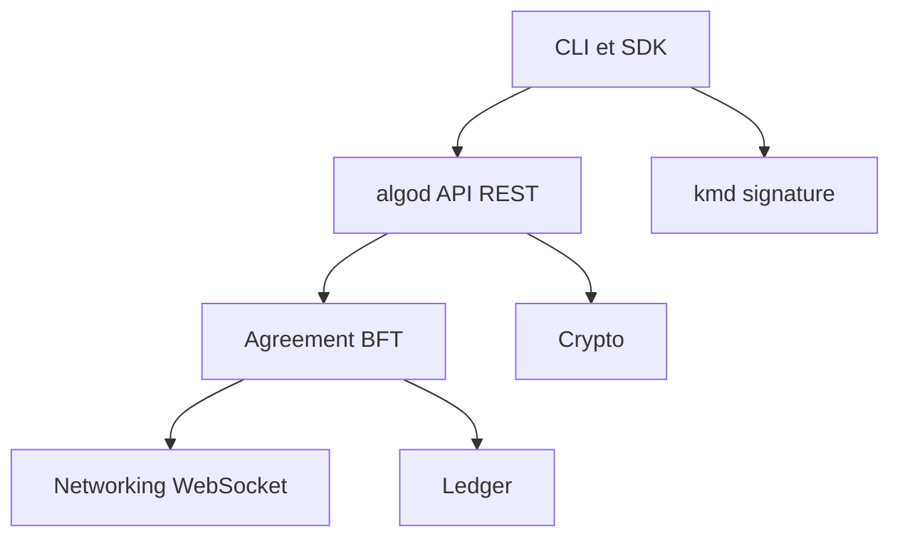

# algorand/go-algorand

> Implémentation officielle en Go d'Algorand, blockchain à preuve d'enjeu : nœud, daemon de clés et outils.

## Le problème
Participer au réseau Algorand ou le tester en local suppose un nœud qui applique le protocole de consensus et expose une API.

## Ce que ça fait vraiment
Le dépôt fournit le daemon `algod` (nœud participant, API REST) et `kmd` (signature isolée, utilisable sur machine hors ligne). Il contient aussi les couches crypto, ledger, accord byzantin, réseau WebSocket, plus `goal` et `carpenter`. Les fichiers genesis de mainnet, testnet et betanet sont inclus.

## Comment c'est branché


## Essayer
```bash
git clone https://github.com/algorand/go-algorand
cd go-algorand
./scripts/configure_dev.sh
make install
make test
${GOPATH}/bin/goal node start -d ~/.algorand
${GOPATH}/bin/carpenter -d ~/.algorand
```

## Coût et pièges
Ubuntu 24.04 est la cible officielle ; macOS demande Homebrew. Compilation Go via `make`. La licence est présente mais GitHub ne l'identifie pas : à lire avant tout usage.

## Ce que ce n'est pas
Ce n'est ni un SDK applicatif ni un outil de données : c'est le logiciel de nœud. Les instructions détaillées d'installation vivent sur le site développeur, pas ici.

## Alternatives
Aucune alternative nommée dans le README.

## Pour toi
Ignorer : un nœud de blockchain n'a aucun rôle dans un flux data, IA ou MLOps, et la licence reste à vérifier.

