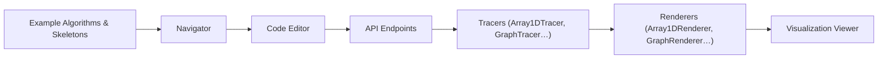

# algorithm-visualizer/algorithm-visualizer

> Plateforme web interactive qui anime des algorithmes à partir de code, pour étudiants et enseignants.

## Le problème
Un algorithme se comprend mal à la lecture ; il faut voir ses étapes.

## Ce que ça fait vraiment
Application React : l'éditeur envoie du code, des tracers en capturent les commandes de visualisation, des renderers (tableaux 1D/2D, graphes, graphiques, nuage de points, Markdown, journal) les affichent. Les algorithmes et les bibliothèques de traçage vivent dans des dépôts séparés de l'organisation. Démo en ligne sur algorithm-visualizer.org.

## Comment c'est branché

Le texte d'architecture est un guide de dessin partiellement supposé.

## Essayer
Aucune commande documentée. Ouvrir la démo en ligne algorithm-visualizer.org.

## Coût et pièges
Gratuit, sans installation. Dernier push en juin 2024, soit plus d'un an ; certaines sections du README (langages et frameworks) sont vides.

## Ce que ce n'est pas
Ce n'est pas un outil de développement ni de profilage : il illustre des algorithmes classiques, pas ton code de production ni des pipelines de données.

## Alternatives
Aucune alternative nommée dans le README.

## Pour toi
À ignorer : valeur pédagogique seulement et projet peu actif ; rien d'utile pour un travail data/IA courant.

