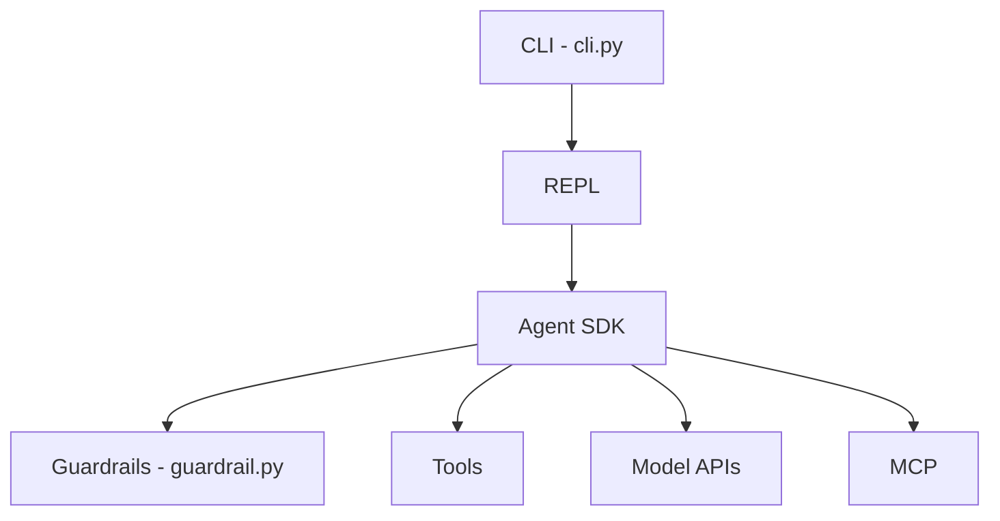

# aliasrobotics/cai

> Cadre Python d'agents pour la sécurité offensive et défensive, archivé, avec 18 articles de recherche associés.

## Le problème
Évaluer ce que des agents LLM peuvent faire en sécurité (CTF, bug bounty, OT, robotique) demande un cadre commun, mesurable et reproductible.

## Ce que ça fait vraiment
Un SDK d'agents (boucle ReAct, Runner, handoffs, guardrails, tracing, MCP, voix) sous une CLI/REPL, avec un catalogue d'agents de sécurité (red team, blue team, DFIR, rétro-ingénierie…) et des outils par domaine. Le modèle est un service externe : OpenAI, Anthropic, Ollama, etc. Le dépôt est réduit à un commit d'archive (arbre v1.1.5, version pro) ; la version publique gelée est `cai-framework` 0.5.10 sur PyPI.

## Comment c'est branché


## Essayer
```bash
python3.12 -m venv cai_env
source cai_env/bin/activate
pip install cai-framework
```
Le README ajoute un `.env` avec la clé du fournisseur choisi ; le bloc de code est tronqué à cet endroit.

## Coût et pièges
Clé d'API du fournisseur à ta charge. L'arbre v1.1.5 est une distribution payante ; `CAI_LICENSE_OFF=1` cible le paquet public. Licence non identifiée par GitHub. Aucun correctif ni patch de sécurité : le README recommande un environnement isolé.

## Ce que ce n'est pas
Pas un projet vivant : le développement continue dans un produit commercial, CSI. Pas non plus un outil d'usage libre sur des cibles quelconques : systèmes autorisés uniquement.

## Alternatives
- GreyDGL/PentestGPT : précurseur cité, toujours maintenu.
- CSI : successeur commercial d'Alias Robotics.

## Pour toi
À ignorer comme outil : archivé, licence floue, version pro non publique. À garder en mémoire comme source de lecture (papiers, benchmarks CAIBench) sur les agents LLM en sécurité.
