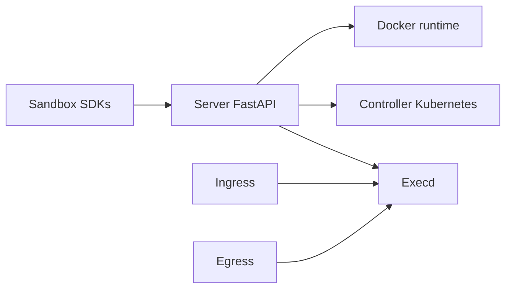

# alibaba/OpenSandbox

> Plateforme de bacs à sable pour applications d'IA, avec SDK multilingues, exécution Docker ou Kubernetes.

## Le problème
Un agent qui exécute du code ou pilote un navigateur a besoin d'un environnement isolé, avec fichiers, commandes et politique réseau.

## Ce que ça fait vraiment
Un serveur FastAPI crée les sandbox sur Docker ou Kubernetes. Dans chaque sandbox, `execd` exécute commandes, fichiers et code. Un proxy d'entrée route le trafic entrant, un composant de sortie applique la politique réseau. SDK Python, JS, Java/Kotlin, C# et Go, plus une CLI (`osb`) et un serveur MCP.

## Comment c'est branché


## Essayer
```bash
uvx opensandbox-server init-config ~/.sandbox.toml --example docker
uvx opensandbox-server
uv pip install opensandbox
```

## Coût et pièges
Docker requis en local, Python 3.10+. Pour une isolation forte, il faut gVisor, Kata ou Firecracker : configuration à ta charge. Le README recommande de figer les images par digest.

## Ce que ce n'est pas
Pas un agent, seulement l'environnement d'exécution. La licence n'est pas déclarée dans le catalogue.

## Alternatives
Le README mentionne kubernetes-sigs/agent-sandbox, avec un exemple d'intégration.

## Pour toi
À adopter pour tester si tu fais exécuter du code par un agent : il sépare l'exécution du reste et se pilote en Python. Vérifie la licence d'abord.
