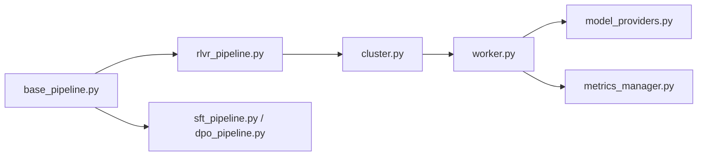

# alibaba/ROLL

> Bibliothèque d'apprentissage par renforcement distribué pour LLM, sur Ray, Megatron-Core, vLLM et SGLang.

## Le problème
Post-entraîner des LLM par renforcement (raisonnement, alignement, agents multi-tours) à grande échelle exige d'orchestrer entraînement et génération sur beaucoup de GPU.

## Ce que ça fait vraiment
Architecture multi-rôles sur Ray avec pipelines RLVR (récompenses vérifiables), agentic RL (multi-tours), distillation, DPO et SFT. Algorithmes : PPO, GRPO, Reinforce++, GSPO, TOPR, GiGPO, StarPO. Génération via vLLM ou SGLang, entraînement via FSDP2 ou Megatron-LM, LoRA, mapping de périphériques automatique et suivi avec SwanLab, WandB ou TensorBoard. Le code analysé mentionne aussi l'entraînement de diffusion.

## Comment c'est branché

## Essayer
Aucune commande documentée dans le README fourni : il renvoie aux guides Installation, Quick Start et aux pipelines.

## Coût et pièges
Suppose un parc de GPU (de la machine seule à des milliers de GPU) ; l'entraînement asynchrone est encore « en cours d'implémentation » et le FP8 en BF16 « en développement ». 133 issues ouvertes.

## Ce que ce n'est pas
Pas un outil pour un poste seul : pensé pour des clusters. Le README cite de nombreux travaux internes Alibaba comme vitrine.

## Alternatives
Aucune alternative citée dans le README.

## Pour toi
À surveiller : référence si tu fais du RL post-entraînement sur cluster, disproportionné sinon.

