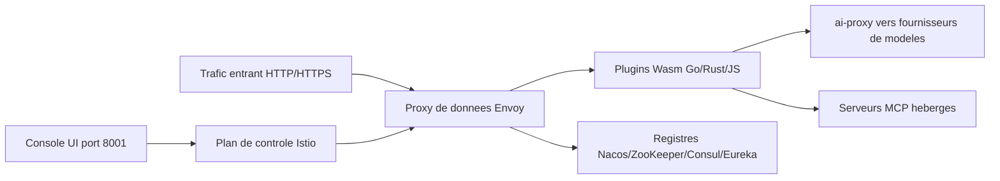

# alibaba/higress

> **Cloud-native API gateway putting LLM traffic, MCP servers and Kubernetes ingress behind one door.**

## The problem

Without it, every kind of traffic gets its own door: an NGINX ingress for HTTP, a hand-rolled proxy for LLM
calls, nothing at all for MCP servers. The README names two pains it was born from at Alibaba: long-lived
connections dropped on every gateway reload, and weak gRPC/Dubbo load balancing — both of which hurt exactly
in AI workloads, where SSE streams stay open.

## What it actually does

Higress is a gateway built on Istio and Envoy, extended by Wasm plugins written in Go, Rust or JS. It ships
a ready-to-use console and a library of official plugins. On the AI side it speaks one unified protocol to
model providers (the catalogue lives under `plugins/wasm-go/extensions/ai-proxy/provider`), with
observability, multi-model load balancing, token rate limiting and caching. It also hosts MCP servers
through the same plugin mechanism, which gives them unified authentication, rate limits, audit logs and
updates without dropping connections. It doubles as a Kubernetes ingress controller — compatible with many
ingress-nginx annotations, listed as a conformant Gateway API implementation — and as a microservice
gateway with discovery from Nacos, ZooKeeper, Consul or Eureka, plus key-auth, hmac-auth, jwt-auth,
basic-auth and oidc plugins and a WAF.

## How it is wired



The README describes the usual Istio/Envoy split: Istio holds the control plane and pushes configuration,
Envoy carries the traffic. Everything specific to Higress runs in the Wasm plugin chain — sandbox-isolated,
independently versioned, hot-upgradable without losing traffic — and that is where the ai-proxy to model
providers and the MCP hosting sit. The console listens on port 8001, HTTP ingress on 8080, HTTPS on 8443.

## Trying it

```bash
# Create a working directory
mkdir higress; cd higress
# Start higress, configuration files will be written to the working directory
docker run -d --rm --name higress-ai -v ${PWD}:/data \
        -p 8001:8001 -p 8080:8080 -p 8443:8443  \
        higress-registry.cn-hangzhou.cr.aliyuncs.com/higress/all-in-one:latest
```

For Kubernetes the README gives a Helm install with a registry mirror:

```bash
# Example: Using North America mirror
helm install higress -n higress-system higress.io/higress --set global.hub=higress-registry.us-west-1.cr.aliyuncs.com --create-namespace
```

## Cost and traps

The software is free; the model-provider keys it relays are on you. Docker is enough for a local trial, a
cluster and Helm for anything else. One concrete trap the README documents: images are published on regional
Aliyun registries, and pulling from `cn-hangzhou` may time out — you then switch to the `us-west-1` or
`ap-southeast-7` mirror, including for the built-in Wasm plugin images, via `global.hub`. The catalogue
metadata declares no license, even though a README badge links to the Apache 2.0 text: check the repository
before any contractual use. Note also that the README leans on superlatives and on performance comparisons
taken from a third-party post; those numbers are not reproducible from this sheet.

## What it is not

It is not a lightweight LLM router you drop in front of one app: it is a full Envoy/Istio gateway with the
operational cost that implies, even though the single Docker command suggests otherwise. It is not an MCP
server either — it hosts and secures the ones you write, and converting OpenAPI specs is done by the separate
openapi-to-mcpserver tool. It is not a managed service: mcp.higress.ai is a hosted demo, not the thing you
deploy. And this repository is not the whole product — the console, the standalone build, the plugin server
and the Go SDK live in separate repositories.

## Alternatives

The README names no direct competitor but positions itself explicitly against **ingress-nginx** (the
Kubernetes NGINX Ingress Controller): pick Higress if NGINX reloads cut your long-lived connections, stay on
NGINX if your traffic is short HTTP and your tooling already fits it. **Envoy** and **Istio**, thanked in the
README, are the underlying bricks: using them bare gives more control and none of the AI/MCP conveniences.
For service discovery, **Nacos** is a companion component, not an alternative.

## For you

If you expose several model providers or MCP servers to agents, this is the single place to put
authentication, token quotas, caching and audit logs instead of recoding them per application. If your need
stops at a proxy in front of one model API, the Envoy/Istio stack is out of proportion.
