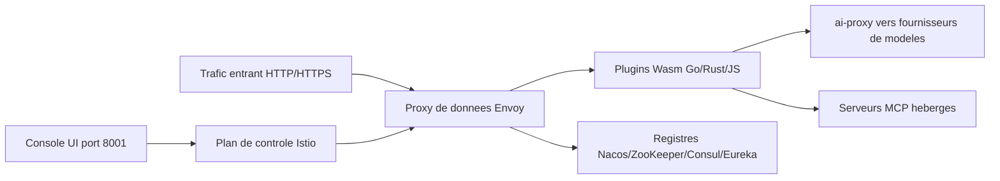

# alibaba/higress

> **Passerelle d'API cloud-native qui place LLM, MCP et ingress Kubernetes derrière une même porte.**

## Le problème

Sans elle, chaque flux a sa propre porte : un ingress NGINX pour le HTTP, un proxy maison pour les appels
LLM, rien du tout pour les serveurs MCP. Le README pointe deux douleurs nées chez Alibaba : les connexions
longues coupées à chaque reload de la passerelle, et un équilibrage de charge gRPC/Dubbo insuffisant —
deux choses qui font mal précisément dans les usages IA, où les flux SSE durent.

## Ce que ça fait vraiment

Higress est une passerelle bâtie sur Istio et Envoy, extensible par plugins Wasm écrits en Go, Rust ou JS.
Elle expose une console prête à l'emploi et une bibliothèque de plugins officiels. Côté IA, elle parle un
protocole unifié vers les fournisseurs de modèles (le répertoire `plugins/wasm-go/extensions/ai-proxy/provider`
en liste le catalogue), avec observabilité, répartition multi-modèles, limitation par tokens et cache.
Elle héberge aussi des serveurs MCP via le même mécanisme de plugins, ce qui leur apporte authentification,
quotas, journaux d'audit et mises à jour sans coupure. Elle sert par ailleurs de contrôleur d'ingress
Kubernetes — compatible avec beaucoup d'annotations d'ingress-nginx, conforme Gateway API — et de passerelle
de microservices, avec découverte via Nacos, ZooKeeper, Consul ou Eureka, et des plugins d'authentification
key-auth, hmac-auth, jwt-auth, basic-auth, oidc, plus un WAF.

## Comment c'est branché



Le README décrit une séparation classique Istio/Envoy : Istio tient le plan de contrôle et pousse la
configuration, Envoy porte le trafic. Tout ce qui est propre à Higress passe par la chaîne de plugins Wasm,
isolés en bac à sable, versionnés indépendamment et rechargeables à chaud sans perdre de trafic — c'est par
là que transitent l'ai-proxy vers les fournisseurs de modèles et l'hébergement MCP. La console écoute sur
le port 8001, l'entrée HTTP sur 8080, HTTPS sur 8443.

## Essayer

```bash
# Create a working directory
mkdir higress; cd higress
# Start higress, configuration files will be written to the working directory
docker run -d --rm --name higress-ai -v ${PWD}:/data \
        -p 8001:8001 -p 8080:8080 -p 8443:8443  \
        higress-registry.cn-hangzhou.cr.aliyuncs.com/higress/all-in-one:latest
```

Pour Kubernetes, le README donne une installation Helm avec choix du miroir de registre :

```bash
# Example: Using North America mirror
helm install higress -n higress-system higress.io/higress --set global.hub=higress-registry.us-west-1.cr.aliyuncs.com --create-namespace
```

## Coût et pièges

Le logiciel est gratuit ; les clés des fournisseurs de modèles que la passerelle relaie restent à ta charge.
Il faut Docker pour l'essai local, un cluster et Helm pour le reste. Piège concret signalé par le README :
les images sont publiées sur des registres régionaux Aliyun, et le pull depuis `cn-hangzhou` peut expirer —
il faut alors basculer sur le miroir `us-west-1` ou `ap-southeast-7`, y compris pour les images des plugins
Wasm intégrés, via `global.hub`. La licence n'est pas déclarée dans les métadonnées du catalogue, même si un
badge du README renvoie vers le texte Apache 2.0 : à vérifier dans le dépôt avant usage contractuel.
Enfin, le README est écrit sur le registre du superlatif (« production grade », comparaisons de performance
reprises d'un billet tiers) — ces chiffres ne sont pas reproductibles depuis la fiche.

## Ce que ce n'est pas

Ce n'est pas un routeur LLM léger qu'on pose devant une application : c'est une passerelle Envoy/Istio
complète, avec le coût d'exploitation correspondant, même si le démarrage Docker donne l'illusion inverse.
Ce n'est pas non plus un serveur MCP : elle héberge et sécurise ceux que tu écris, la conversion depuis
OpenAPI se fait avec l'outil séparé openapi-to-mcpserver. Et ce n'est pas un service managé — mcp.higress.ai
est une démonstration hébergée, pas le produit que tu déploies. Enfin, ce dépôt ne contient pas tout : la
console, la version standalone, le serveur de plugins et le SDK Go vivent dans des dépôts distincts.

## Alternatives

Le README ne propose pas de concurrent direct, mais il se positionne explicitement contre **ingress-nginx**
(le Kubernetes NGINX Ingress Controller) : choisir Higress si les reloads NGINX coupent tes connexions
longues, rester sur NGINX si ton trafic est du HTTP court et ta chaîne d'outils déjà calée dessus.
**Envoy** et **Istio**, remerciés dans le README, sont les briques sous-jacentes : les utiliser nus donne
plus de contrôle et aucune des commodités IA/MCP de Higress. Pour la découverte de services, **Nacos** est
un composant complémentaire, pas une alternative.

## Pour toi

Si tu exposes plusieurs fournisseurs de modèles ou des serveurs MCP à des agents, c'est le point unique où
poser authentification, quotas par tokens, cache et journaux d'audit sans les recoder par application.
Si ton besoin s'arrête à un proxy devant une seule API de modèle, l'ensemble Envoy/Istio est disproportionné.
