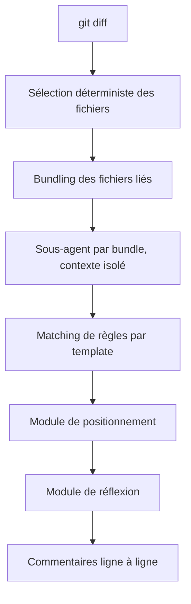

# alibaba/open-code-review

> CLI de revue de code par LLM, issue de l'outil interne d'Alibaba, précision privilégiée au rappel.

## Le problème
Un agent généraliste lâché sur un gros diff saute des fichiers, place ses commentaires au mauvais endroit et rend une qualité instable.
La cause : une architecture purement langagière, sans contrainte dure sur le processus de revue.

## Ce que ça fait vraiment
Lit les diffs Git, envoie les fichiers modifiés à un LLM configurable via un agent outillé, et produit des commentaires structurés à la ligne près.
La partie déterministe est du code, pas du prompt : sélection exacte des fichiers, regroupement des fichiers liés en unités de revue isolées (sous-agents concurrents), correspondance fine des règles par fichier, modules externes de positionnement et de réflexion.
La partie agent ne garde que la décision dynamique : prompts et outils spécialisés revue, distillés depuis des traces d'appels en production.
`ocr scan` revoit des fichiers entiers sans diff ; le mode délégation laisse votre propre agent faire la revue, OCR ne gérant que sélection et règles.

## Comment c'est branché


## Essayer
```bash
npm install -g @alibaba-group/open-code-review
ocr config provider
ocr config model
ocr review --from main --to feature-branch
ocr scan --path internal/agent
```

## Coût et pièges
Git >= 2.41 requis. Un endpoint de modèle à configurer, sauf en mode délégation où votre agent fournit le sien.
Le README documente une intégration OpenTelemetry pour l'observabilité : à vérifier avant déploiement en entreprise.

## Ce que ce n'est pas
Ce n'est pas un outil à haut rappel : le README annonce un rappel inférieur aux agents généralistes, compromis assumé contre le bruit.
Ce n'est pas un remplaçant de revue humaine, ni un linter statique.
Le benchmark cité (50 dépôts, 200 PR, 1 505 problèmes annotés) est produit par le projet.

## Alternatives
- Claude Code avec Skills — comparé directement dans le README comme l'agent généraliste de référence.
- Codex, Cursor, Kimi Code, OpenCode — hôtes supportés en mode délégation plutôt que concurrents.

## Pour toi
Intéressant si tu veux une revue automatique en CI avec peu de faux positifs ; le mode délégation évite une deuxième clé d'API.
