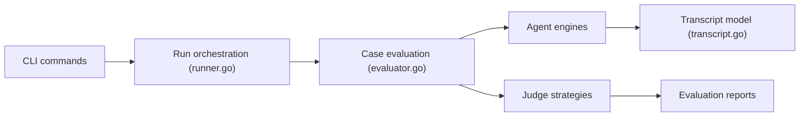

# alibaba/skill-up

> CLI qui évalue des Agent Skills par des cas YAML et aide à les améliorer en boucle.

## Le problème
Mesurer la qualité d'un skill d'agent reste artisanal : dossiers d'exécution ad hoc, pas de comparaison entre moteurs ni de rapports reproductibles.

## Ce que ça fait vraiment
CLI Go : définit l'évaluation dans `eval.yaml` et `cases/*.yaml`, prépare l'espace de travail, installe le skill, lance un moteur d'agent (Claude Code, Codex, Qoder CLI, Qwen Code ou moteur personnalisé), note avec des juges (règles, script ou agent) et produit `grading.json`, `benchmark.json`, JUnit XML et HTML. Le skill `skill-upper` pilote la boucle d'amélioration par conversation. Une GitHub Action exécute les évals en CI.

## Comment c'est branché


## Essayer
```bash
curl -fsSL https://raw.githubusercontent.com/alibaba/skill-up/main/install.sh | bash
skill-up init
skill-up validate
skill-up run
skill-up import ./evals/evals.json --output ./evals
```

## Coût et pièges
Gratuit, mais chaque exécution appelle un moteur d'agent avec ta clé ou ton abonnement. L'action GitHub est Linux seulement. Le projet date de mai 2026.

## Ce que ce n'est pas
Ce n'est pas un benchmark de modèles : il évalue des skills. Il améliore les skills en conversation, sans garantie de résultat.

## Alternatives
Aucune alternative nommée dans le README.

## Pour toi
À surveiller : pertinent si tu écris ou maintiens des Agent Skills et veux de l'éval en CI ; le projet est jeune, mais sa compatibilité avec `evals.json` d'Anthropic limite le risque de verrouillage.

