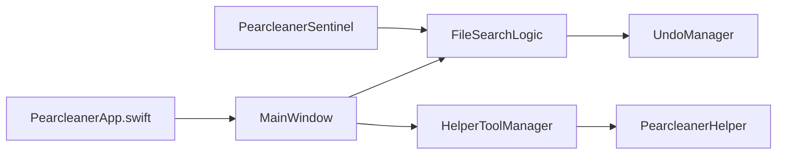

# alienator88/Pearcleaner

> Application macOS qui désinstalle proprement les applications et leurs fichiers résiduels.

## Le problème
Glisser une application dans la corbeille laisse des fichiers de préférences, caches et données éparpillés dans le système.

## Ce que ça fait vraiment
Application SwiftUI pour macOS 13+ : recherche des fichiers associés à une app, sélection puis suppression avec historique et annulation. Aussi : recherche de fichiers orphelins, gestion de Homebrew, inspection de paquets PKG, mises à jour d'applications, allègement d'architectures et de traductions, agent « Sentinel » qui nettoie quand une app va à la corbeille. Un assistant privilégié gère les dossiers système.

## Comment c'est branché


## Essayer
```bash
brew install --cask pearcleaner
```

## Coût et pièges
Gratuit. Demande l'accès complet au disque et un assistant privilégié pour agir sur les dossiers système. Le projet est « en pause » : plus de mises à jour depuis fin 2025, sans accès à un Mac pour l'auteur ; issues, PR et versions suspendues sans échéance. Licence source-available de type fair-code : à lire.

## Ce que ce n'est pas
Pas un outil de sécurité ni d'administration de flotte. L'auteur précise que son seul site légitime est itsalin.com ; les autres sources de téléchargement sont à éviter.

## Alternatives
Le README cite AppCleaner de Freemacsoft comme source d'inspiration.

## Pour toi
Ignorer : utilitaire Mac en pause, avec des droits étendus sur le système, sans lien avec data/IA/MLOps.

