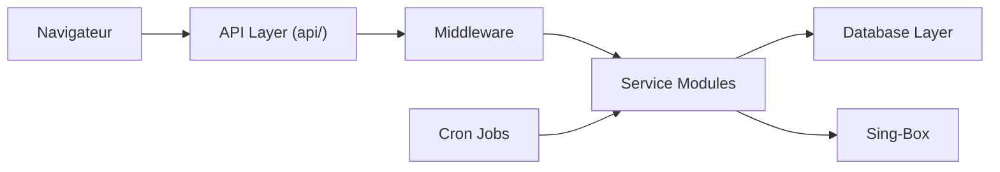

# alireza0/s-ui

> Panneau web d'administration pour proxys multi-protocoles, construit sur Sing-Box.

## Le problème
Configurer à la main des entrées, sorties, routage et clients d'un cœur Sing-Box est fastidieux.

## Ce que ça fait vraiment
Un serveur Go avec interface web, API REST (`/apiv2`) et service d'abonnement (liens, JSON, Clash). Il gère protocoles (VLESS, VMess, Trojan, Shadowsocks, Hysteria, TUIC…), clients avec quota et expiration, routage avancé, état du système, tâches planifiées, base de données locale et HTTPS avec certificat fourni par l'utilisateur.

## Comment c'est branché


## Essayer
```bash
bash <(curl -Ls https://raw.githubusercontent.com/alireza0/s-ui/master/install.sh)
docker compose up -d
```

## Coût et pièges
Gratuit. Le panneau écoute sur le port 2095 avec l'identifiant `admin` / `admin` par défaut : à changer aussitôt. Le README déconseille l'usage en production et le limite à l'apprentissage personnel.

## Ce que ce n'est pas
Pas un outil data/IA. Pas un produit de production selon son propre avertissement. L'installateur `curl | bash` exécute un script distant.

## Alternatives
Aucune alternative nommée dans le README.

## Pour toi
À ignorer : panneau de proxy sans rapport avec un travail data/IA/MLOps, et son auteur le déconseille pour la production.

