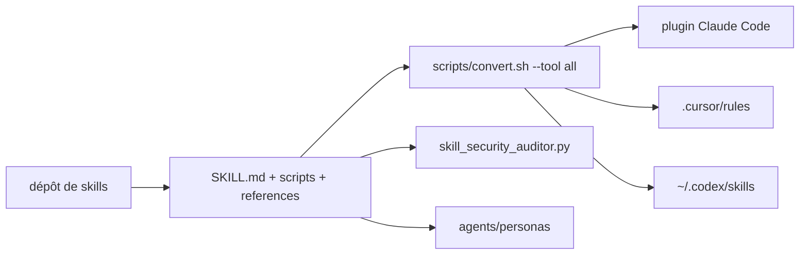

# alirezarezvani/claude-skills

> Bibliothèque de 388 skills d'agent, convertibles vers treize outils de code.

## Le problème
Un agent de code n'a pas l'expertise d'un domaine : il faut lui réécrire le même cadrage à chaque session.
Les skills écrits pour un outil ne se réutilisent pas dans un autre.

## Ce que ça fait vraiment
Chaque skill est un dossier : `SKILL.md` (instructions et cadres de décision), `scripts/`, `references/`, `assets/`.
727 outils Python en ligne de commande, tous en bibliothèque standard, donc sans installation de dépendances.
Couvre 20 domaines : ingénierie, produit, marketing, recherche académique, conformité, conseil de direction, finance, productivité.
`scripts/convert.sh --tool all` génère les formats natifs de chaque outil ; `skill-security-auditor` audite un skill avant installation.

## Comment c'est branché


## Essayer
```bash
git clone https://github.com/alirezarezvani/claude-skills.git
cd claude-skills
./scripts/gemini-install.sh
./scripts/convert.sh --tool all
./scripts/install.sh --tool cursor --target /path/to/project
python3 engineering/skill-security-auditor/scripts/skill_security_auditor.py /path/to/skill/
```

## Coût et pièges
Gratuit ; sous Windows, cloner avec `git clone -c core.symlinks=true` et poser `PYTHONUTF8=1`, sinon les arbres miroirs sont inutilisables.
Hermes et Mistral Vibe exigent une synchronisation manuelle après clonage.

## Ce que ce n'est pas
Ce n'est pas un ensemble validé : 388 skills d'un seul auteur, de profondeur très inégale, dont plusieurs repris d'autres dépôts.
Ce n'est pas homogène côté chiffres : le README annonce tour à tour 345, 346 et 388 skills, 580, 706 puis 727 outils Python.
Ce n'est pas anodin à installer en bloc : chacun de ces scripts s'exécutera dans ton agent — d'où l'auditeur fourni.

## Alternatives
microsoft/SkillOpt : moteur d'auto-évolution nocturne, repris tel quel ici sous le nom `skillopt-sleep`.
Forward-Future/loop-library : le catalogue de boucles d'agent, également repris verbatim.
anthropics/launch-your-agent : la base Apache-2.0 réimplémentée par le module Agent Launcher.

## Pour toi
À traiter comme un catalogue d'idées : pioche un ou deux skills, passe-les à l'auditeur, n'installe jamais le bloc entier.
