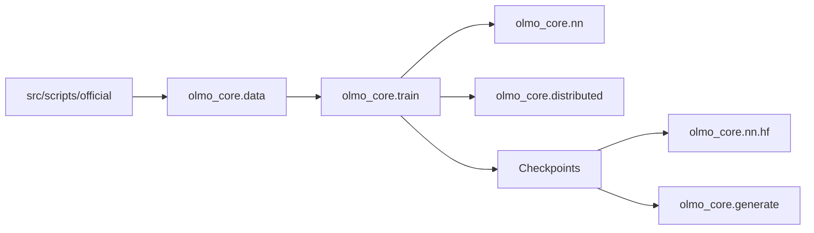

# allenai/OLMo-core

> Briques PyTorch pour modéliser et entraîner les modèles OLMo, avec les scripts officiels d'entraînement.

## Le problème
Entraîner un LLM ouvert à grande échelle demande données, parallélisme, checkpoints et évaluation assemblés à la main.

## Ce que ça fait vraiment
Bibliothèque `olmo_core` avec modules de données (mélanges, tokenisation), blocs de transformeur (attention, MoE, float8), boucle d'entraînement à callbacks, parallélisme distribué (données, tenseur, pipeline, experts, contexte), conversion vers Hugging Face, génération et évaluation. `src/scripts/official/` contient les recettes d'OLMo-2 et OLMo-3, lancées par `torchrun`.

## Comment c'est branché


## Essayer
```bash
pip install ai2-olmo-core
torchrun --nproc-per-node=8 src/scripts/official/OLMo2/OLMo-2-0325-32B-train.py \
  --save-folder=/path/to/save/checkpoints
python -m olmo_core.generate.chat https://olmo-checkpoints.org/ai2-llm/Olmo-3-1025-7B/stage3/step11921/ --max-new-tokens 512
```

## Coût et pièges
Gratuit, mais un entraînement réel exige des clusters de GPU ; les images Docker sont testées sur H100 maison et peuvent ne pas marcher sur ton matériel. Plusieurs backends (flash-attn, TransformerEngine, grouped_gemm) sont à installer séparément.

## Ce que ce n'est pas
Pas un outil d'inférence prêt à servir : le README renvoie vers transformers et vLLM. Pas de poids inclus : ils sont sur Hugging Face.

## Alternatives
OLMo Eval et olmes pour l'évaluation ; Hugging Face Transformers et vLLM pour l'inférence.

## Pour toi
À surveiller : référence de code d'entraînement LLM lisible et maintenue, utile si tu pré-entraînes ou fais du fine-tuning lourd ; sinon inutile.
