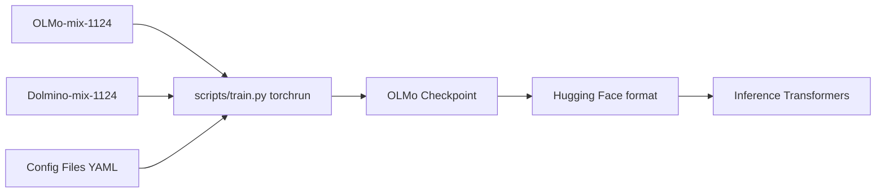

# allenai/OLMo

> Code d'entraînement et checkpoints ouverts des modèles de langue OLMo 2, pour chercheurs et praticiens.

## Le problème
La plupart des LLM « ouverts » publient les poids mais ni les données, ni les configs, ni les checkpoints intermédiaires.

## Ce que ça fait vraiment
Entraînement en deux étapes : données web (OLMo-mix-1124) puis données ciblées (Dolmino-mix-1124), configs YAML fournies.
Checkpoints tous les 1000 pas pour 1B, 7B, 13B, au format OLMo et Hugging Face ; runs WandB publics.
Soupe de modèles (moyenne de poids) en étape 2 ; variantes instruct.
Inférence via Transformers, quantification 8 bits, exemple de déploiement Modal.

## Comment c'est branché


## Essayer
```bash
git clone https://github.com/allenai/OLMo.git
cd OLMo
pip install -e .[all]
pip install ai2-olmo
torchrun --nproc_per_node=8 scripts/train.py {path_to_train_config}
python scripts/train.py configs/tiny/OLMo-20M.yaml --save_overwrite
```

## Coût et pièges
Reproduire l'entraînement exige 8 GPU et plus ; données streamées en HTTP, à télécharger pour grande échelle.
Le 32B et les nouveaux entraînements sont passés sur OLMo-core.

## Ce que ce n'est pas
Pas le dépôt le plus récent : OLMo-core prend la relève.
Pas un serveur d'inférence.

## Alternatives
- OLMo-core : nouveau trainer, obligatoire pour le 32B.
- OLMo Eval / olmes : pour l'évaluation.

## Pour toi
À surveiller : référence rare de LLM réellement ouvert, précieuse pour comprendre ou reproduire un pré-entraînement, mais vise OLMo-core pour du neuf.
