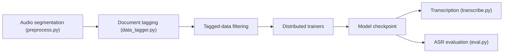

# allenai/OLMoASR

> Modèles ouverts de reconnaissance vocale anglaise et pipeline complet de données à l'évaluation, publiés par Ai2.

## Le problème
Les modèles de reconnaissance vocale robustes ont rarement leurs données et leur méthode d'entraînement publiées.

## Ce que ça fait vraiment
Montre les étapes : transcriptions en JSONL, segmentation audio en 30 s, étiquetage et filtrage, entraînement distribué (`torchrun`, DDP ou FSDP), évaluation. Six tailles (tiny.en à large.en-v2) entraînées sur OLMoASR-Mix, 1 M d'heures. Transcription en Python avec horodatage par phrase. Tableaux de WER fournis.

## Comment c'est branché


## Essayer
```bash
git clone https://github.com/allenai/OLMoASR.git
pip install -r requirements/requirements.txt
pip install -e .
python -c "import olmoasr; m = olmoasr.load_model('medium', inference=True); print(m.transcribe('audio.mp3'))"
```

## Coût et pièges
ffmpeg et wandb requis ; entraînement multi-GPU ; données à télécharger depuis Hugging Face. Dernier push le 2025-10-29.

## Ce que ce n'est pas
Pas multilingue : anglais seulement. Pas de CLI (« en développement »). La section « Citing » indique « Coming soon ».

## Alternatives
Aucune alternative nommée (Whisper est évoqué seulement par le nom du format de résultat, sans mention explicite).

## Pour toi
À surveiller : base reproductible pour entraîner ou comparer de l'ASR anglais, avec poids et données ouverts.

