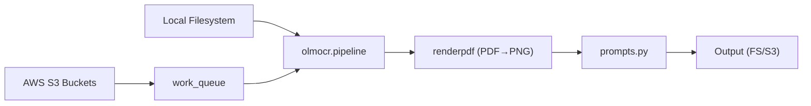

# allenai/olmocr

> Pipeline qui convertit PDF et images en Markdown propre via un VLM de 7B paramètres.

## Le problème
Extraire du texte exploitable de PDF scannés, multi-colonnes, avec tableaux ou équations donne du texte désordonné avec les outils OCR classiques.

## Ce que ça fait vraiment
Rend chaque page (poppler), puis l'envoie à olmOCR-2-7B servi par vLLM, localement ou sur un serveur compatible OpenAI.
Produit Markdown ou Dolma JSON dans un ordre de lecture naturel, sans en-têtes ni pieds de page.
Passe à l'échelle via une file de travail dans S3 partagée par plusieurs nœuds.
Fournit olmOCR-Bench (7 000 tests) et le code d'entraînement SFT/GRPO.

## Comment c'est branché


## Essayer
```bash
conda create -n olmocr python=3.11
conda activate olmocr
pip install olmocr[gpu] --extra-index-url https://download.pytorch.org/whl/cu128
olmocr ./localworkspace --markdown --pdfs olmocr-sample.pdf
docker pull alleninstituteforai/olmocr:latest-with-model
```

## Coût et pièges
En local : GPU NVIDIA 12 Go minimum et 30 Go de disque. Via un fournisseur externe, environ 0,07–0,10 $ par million de tokens en entrée selon le tableau du README.

## Ce que ce n'est pas
Pas un OCR léger pour CPU. Le README contient un bloc de code tronqué (section « Combined Installation »). Au benchmark du README, Chandra OCR et Infinity-Parser font légèrement mieux.

## Alternatives
- Marker : noté 76,1 au benchmark du README.
- PaddleOCR-VL : 80,0.
- Chandra OCR : 83,1, au-dessus d'olmOCR v0.4.0 (82,4).

## Pour toi
À adopter pour préparer des corpus RAG à partir de PDF : Apache-2.0, porté par AI2, avec un benchmark publié et un mode serveur distant si tu n'as pas de GPU.
