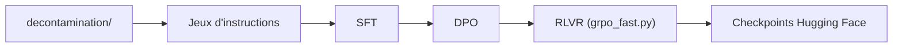

# allenai/open-instruct

> Code ouvert d'affinage, de préférence (DPO) et d'apprentissage par récompenses vérifiables (RLVR) de LLM.

## Le problème
Reproduire le post-entraînement d'un LLM (SFT, DPO, RL) sur des données publiques demande un code unifié et éprouvé.

## Ce que ça fait vraiment
Scripts et code pour SFT, DPO et RLVR (`grpo_fast.py`), utilisés pour Tülu 3 et OLMo-2, avec configurations DeepSpeed, décontamination des jeux d'évaluation et scripts de quantification. Support OLMo-core pour une SFT plus économe en GPU. L'évaluation native n'est plus maintenue (OLMES conseillé).

## Comment c'est branché


## Essayer
```bash
uv sync
bash scripts/train/tulu3/finetune_8b.sh
bash scripts/train/tulu3/dpo_8b.sh
./scripts/train/build_image_and_launch.sh scripts/train/debug/single_gpu_on_beaker.sh
```

## Coût et pièges
8 GPU pour les exemples 8B ; le lancement RL s'appuie sur Beaker (interne AI2). Aucune garantie de compatibilité ascendante (« research codebase »). Les modèles V2 relèvent de la licence AI2 ImpACT.

## Ce que ce n'est pas
Pas une bibliothèque stable : code de recherche. Les modèles Llama héritent des licences de leur base.

## Alternatives
- OLMES : évaluation recommandée à la place de l'évaluation native.
- OLMo-core : SFT plus efficace pour les modèles supportés.

## Pour toi
À adopter comme référence de recette de post-entraînement ouverte ; à exécuter seulement si tu disposes de plusieurs GPU.

