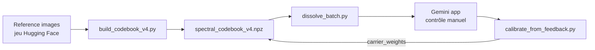

# aloshdenny/reverse-SynthID

> Recherche sur la robustesse du filigrane invisible SynthID de Google : détection, analyse spectrale et contournement.

## Le problème
Les filigranes d'images générées par IA sont présentés comme fiables, mais leur robustesse réelle est peu documentée hors de Google. Ce dépôt sert à la mesurer de l'extérieur, sans accès à l'encodeur.

## Ce que ça fait vraiment
- Analyse spectrale (FFT, cohérence de phase) d'images Gemini de référence, pour repérer des fréquences porteuses dépendantes de la résolution.
- Détecteur local, avec un « codebook » par modèle et par résolution (~220 Mo pour 14 profils).
- Pipelines de suppression du filigrane (V3 spectral, V4 en 7 étapes), avec validation manuelle dans l'application Gemini.
- Fork avec application de bureau en glisser-déposer (gui/README.md).

## Comment c'est branché


## Essayer
Seules l'installation et la détection sont reprises ici ; les commandes de suppression du filigrane existent dans le README et ne sont pas reproduites volontairement.
```bash
git clone https://github.com/aloshdenny/reverse-SynthID.git
cd reverse-SynthID
python -m venv venv
source venv/bin/activate
pip install -r requirements.txt
python src/extraction/robust_extractor.py detect image.png \
    --codebook artifacts/codebook/robust_codebook.pkl
```

## Coût et pièges
Gratuit, mais l'étape de régénération exige torch + diffusers (GPU conseillé) et le codebook V4 pèse ~220 Mo. La validation passe par l'application Gemini, donc un compte Google et un geste manuel.

## Ce que ce n'est pas
Ce n'est pas un détecteur de production : le README annonce ~90 % de précision sur un jeu restreint (20 images validées pour le contournement). Les résultats valent pour Gemini à l'instant T et peuvent être invalidés par Google. La licence n'est pas identifiée par GitHub. Usage déclaré : recherche et éducation ; présenter un contenu IA comme humain est explicitement proscrit par l'auteur, et peut être illégal selon les juridictions.

## Alternatives
- SynthID (Google DeepMind) : le système étudié, cité dans le README avec son papier (arXiv:2510.09263).
- Jeu de référence `aoxo/reverse-synthid` sur Hugging Face : pour reproduire l'analyse sans le code de contournement.

## Pour toi
À surveiller comme étude de robustesse des filigranes IA : utile si tu évalues la provenance des contenus, mais son usage principal (retirer la marque) est à double tranchant et la licence reste à clarifier.

