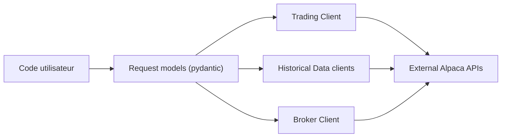

# alpacahq/alpaca-py

> SDK Python officiel d'Alpaca pour trader, récupérer des données de marché et bâtir des applications de courtage.

## Le problème
Appeler à la main les API REST et WebSocket d'un courtier pour passer des ordres et charger l'historique est fastidieux et sujet aux erreurs.

## Ce que ça fait vraiment
Clients séparés pour l'API Trading, l'API Market Data (actions, crypto, options, actualités, en historique et en flux) et l'API Broker. Requêtes modélisées en objets validés par pydantic ; les barres se convertissent en DataFrame pandas via `.df`. Bac à sable disponible. Les données crypto ne demandent pas de clé.

## Comment c'est branché


## Essayer
```shell
pip install alpaca-py
```
```python
from alpaca.data.historical import CryptoHistoricalDataClient
client = CryptoHistoricalDataClient()
```

## Coût et pièges
Python 3.10+. Compte Alpaca gratuit à créer ; clés en mode paper pour tester. Le trading réel engage de l'argent réel.

## Ce que ce n'est pas
Pas un moteur de stratégie ni de backtest. Ne conseille rien ; dépend entièrement du service Alpaca.

## Alternatives
alpaca-trade-api, l'ancien SDK cité dans le README, remplacé par celui-ci.

## Pour toi
À surveiller : pratique pour alimenter des jeux de données financiers en pandas, mais lié à un courtier tiers et à un compte.

