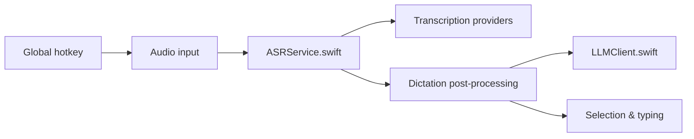

# altic-dev/FluidVoice

> Application macOS de dictée vocale locale avec amélioration IA optionnelle et commandes vocales.

## Le problème
Les apps de dictée envoient souvent l'audio dans le cloud et s'intègrent mal à toutes les applications.

## Ce que ça fait vraiment
Raccourci global, transcription locale (Parakeet, Nemotron, Whisper, Apple Speech, Cohere Transcribe) avec aperçu en direct autour de l'encoche.
Insertion du texte dans n'importe quelle app via l'accessibilité ; mode Write (réécrire une sélection), mode Command (piloter le Mac).
Post-traitement par OpenAI, Groq, fournisseur perso ou « Fluid Intelligence » local (moteur privé, non open source).
Historique audio local, prompts par application, API HTTP locale.

## Comment c'est branché


## Essayer
```bash
brew install --cask fluidvoice
git clone https://github.com/altic-dev/FluidVoice.git
cd FluidVoice
./build.sh
```

## Coût et pièges
Gratuit ; macOS 15+, Apple Silicon pour tous les modèles, ~1 Go par modèle et 3,5 Go pour Fluid Intelligence.
Télémétrie : signal d'activité hebdomadaire toujours envoyé, analytics détaillés activés par défaut.

## Ce que ce n'est pas
Pas entièrement open source : Fluid Intelligence est privé.
Ni Linux ni Windows pour l'instant.

## Alternatives
Aucune alternative nommée dans le README.

## Pour toi
À surveiller comme outil personnel de productivité sur Mac ; la télémétrie par défaut et le moteur privé empêchent de le recommander sans réserve.
