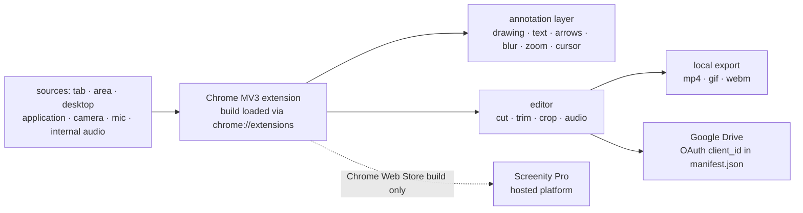

# alyssaxuu/screenity

> **Chrome screen recording and annotation extension, local, no account and no quota.**

## The problem

Recording a demo, a reproducible bug or a tutorial usually means going through an online
service: an account to create, a capped recording length, a watermark, and a video that leaves
for a third party even though it shows an internal screen. Annotating or cropping it afterwards
takes a second tool.

## What it actually does

Screenity records a tab, a selected area, the desktop, a single application or the camera, with
the microphone or internal audio and a push-to-talk mode.

While recording, you draw on the screen (text, arrows, shapes), blur sensitive page content,
highlight clicks and cursor, switch to spotlight mode and zoom into an area. The README also
announces "AI-powered" camera backgrounds and camera blur, without saying where that runs.

Afterwards an editor cuts, trims, crops, removes or adds audio. Export goes to mp4, gif or webm,
or straight to Google Drive to get a share link.

The README states that nothing is collected and that the tool works offline, with no sign-in and
no time limit. Self-hosted, the extension is declared local-only: no API calls, no sign-in flows,
the code paths tied to Screenity Pro being active only in the Chrome Web Store build.

## How it is wired

No code-derived diagram exists for this repository: the graph below is rebuilt from the README
alone, so it does not use real file names — except `manifest.json`, the only file the README
names.



## Trying it

```bash
# Development version (README) — Node.js >= 14
npm install
npm start
# then chrome://extensions/ → developer mode → "Load unpacked" → build folder
npm run build
```

For self-hosting without building, the README says to download `Build.zip` from the releases
page, unzip it, open `chrome://extensions/`, enable developer mode and load the folder (not the
ZIP) through "Load unpacked". Cloning the repository is spelled out in prose, with no command
given.

## Cost and gotchas

- **Free, no account and no API key** for everyday use: the README insists there is no limit on
  length or number of videos.
- **Google Drive is not free to set up**: enabling upload means replacing the `client_id` in
  `manifest.json` with your own linked extension key, created in the Google Cloud Console
  (OAuth Client ID > Chrome App) with a persistent extension key. That is a Google Cloud account
  to open, and the only third-party dependency.
- **GPLv3 since version 3.0.0** (MV3). The README points explicitly at the license and at Terms
  of Service covering intellectual property. The author states that self-hosting is fine for
  personal, educational or internal use, and asks to be contacted about a commercial product
  built from it.
- **Development version**: Node.js >= 14, and every code change requires `npm run build` plus a
  reload of the extension.
- **No VRAM, RAM or CPU figures** are documented anywhere, including for the "AI-powered" camera
  backgrounds.

## What it is not

- **Not a desktop application nor a cross-platform service**: it is a Chrome extension. The
  README mentions neither Firefox, nor Safari, nor a standalone binary.
- **Not the Screenity Pro platform**: link sharing, multi-scene editing, zoom keyframes and
  captions belong to the paid hosted offering, not to this repository. Self-hosted, you get a
  local recorder, not a team workspace.
- **Not a foundation project**: the README names a solo developer, and supporting "the solo
  developer behind it" is the stated funding model.

## Alternatives

No comparable screen-capture alternative in the catalogue: among the given neighbours,
`snakers4/silero-vad` (voice activity detection) and `huggingface/transformers` (models) work on
audio and video at a completely different layer, and `NexaAI/nexa-sdk` is unrelated. Only
`alexballas/go2tv` touches video from a user's point of view:

| | When to prefer it |
|---|---|
| **alexballas/go2tv** | Prefer it to *cast* an already produced video to a TV or a device on the network. Screenity sits upstream: it makes the file, it does not stream it. |

## For you

Little to do with a day-to-day data / AI / MLOps chain, but this is the tool to keep at hand for
everything around it: filming a notebook going wrong, walking through a dashboard in review,
capturing a bug reproduction — without sending a production screen to a third party or hitting a
five-minute cap. Worth adopting, keeping GPLv3 in mind if you ever think of deriving a product
from it.
