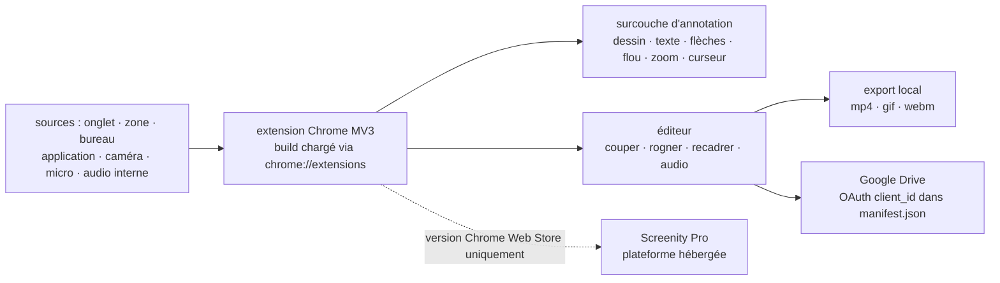

# alyssaxuu/screenity

> **Extension Chrome d'enregistrement d'écran et d'annotation, locale, sans compte ni quota.**

## Le problème

Filmer une démo, un bug reproductible ou un tutoriel passe d'ordinaire par un service en
ligne : compte à créer, durée de capture bridée, filigrane, et la vidéo qui part chez un tiers
alors qu'elle montre un écran interne. Annoter ou recadrer ensuite demande un second outil.

## Ce que ça fait vraiment

Screenity enregistre un onglet, une zone, le bureau, une application ou la caméra, avec le
micro ou l'audio interne et un mode « push to talk ».

Pendant l'enregistrement, on dessine sur l'écran (texte, flèches, formes), on floute des
contenus sensibles d'une page, on met en avant les clics et le curseur, on passe en mode
projecteur, on zoome sur une zone. Le README annonce aussi des fonds de caméra « AI-powered »
et un flou de caméra, sans préciser où le calcul a lieu.

Après coup, un éditeur permet de couper, rogner, recadrer, retirer ou ajouter de l'audio.
L'export se fait en mp4, gif ou webm, ou directement vers Google Drive pour obtenir un lien.

Le README affirme que rien n'est collecté et que l'outil fonctionne hors ligne, sans connexion
ni limite de durée. En auto-hébergement, l'extension est déclarée « local-only » : pas d'appel
d'API, pas d'authentification, les chemins de code reliés à Screenity Pro n'étant actifs que
dans la version du Chrome Web Store.

## Comment c'est branché

Aucun diagramme tiré du code n'existe pour ce dépôt : ce schéma est reconstruit depuis le seul
README, et n'utilise donc pas les vrais noms de fichiers — à l'exception de `manifest.json`,
seul fichier nommé dans le README.



## Essayer

```bash
# Version de développement (README) — Node.js >= 14
npm install
npm start
# puis chrome://extensions/ → mode développeur → « Load unpacked » → dossier build
npm run build
```

Pour l'auto-hébergement sans compiler, le README indique de télécharger le `Build.zip` de la
page des releases, de le décompresser, d'ouvrir `chrome://extensions/`, d'activer le mode
développeur et de charger le dossier (pas le ZIP) via « Load unpacked ». L'étape de clonage
du dépôt est décrite en toutes lettres, sans ligne de commande associée.

## Coût et pièges

- **Gratuit, sans compte ni clé d'API** pour l'usage courant : le README insiste sur l'absence
  de limite de durée et de nombre de vidéos.
- **Google Drive n'est pas gratuit en configuration** : pour activer l'upload, il faut
  remplacer le `client_id` dans `manifest.json` par sa propre clé d'extension, créée dans la
  Google Cloud Console (OAuth Client ID > Chrome App) avec une clé d'extension persistante.
  C'est un compte Google Cloud à ouvrir, et la seule dépendance à un service tiers.
- **Licence GPLv3 depuis la version 3.0.0** (MV3). Le README renvoie explicitement à la licence
  et à des Conditions d'utilisation portant sur la propriété intellectuelle. L'auteur précise
  que l'auto-hébergement convient pour un usage personnel, éducatif ou interne, et demande à
  être contacté pour un produit commercial dérivé.
- **Version de développement** : Node.js >= 14, et chaque modification de code impose un
  `npm run build` puis un rechargement de l'extension.
- **Aucun chiffre de VRAM, de RAM ou de charge CPU** n'est documenté, y compris pour les fonds
  de caméra « AI-powered ».

## Ce que ce n'est pas

- **Ce n'est pas une application de bureau ni un service multiplateforme** : c'est une extension
  Chrome. Le README ne mentionne ni Firefox, ni Safari, ni binaire autonome.
- **Ce n'est pas la plateforme Screenity Pro** : le partage par lien, le montage multi-scènes,
  les keyframes de zoom et les sous-titres appartiennent à l'offre payante hébergée, pas au
  dépôt. Auto-hébergé, on obtient un enregistreur local, pas un espace d'équipe.
- **Ce n'est pas un projet de fondation** : le README désigne un développeur solo, et l'appel à
  soutenir « le développeur solo derrière le projet » est le modèle de financement affiché.

## Alternatives

Aucune alternative comparable dans le catalogue pour la capture d'écran : parmi les voisins
fournis, `snakers4/silero-vad` (détection d'activité vocale) et `huggingface/transformers`
(modèles) travaillent l'audio et la vidéo à un tout autre étage, et `NexaAI/nexa-sdk` n'a pas
de rapport. Seul `alexballas/go2tv` touche à la vidéo côté usage :

| | Quand le préférer |
|---|---|
| **alexballas/go2tv** | À préférer pour *diffuser* une vidéo déjà produite vers un téléviseur ou un appareil du réseau. Screenity est en amont : il fabrique le fichier, il ne le diffuse pas. |

## Pour toi

Peu de rapport avec la chaîne data / IA / MLOps au quotidien, mais c'est l'outil à avoir sous
la main pour ce qui l'entoure : filmer un notebook qui déraille, montrer un tableau de bord en
revue, capturer une reproduction de bug — sans envoyer un écran de production chez un tiers ni
buter sur une limite de cinq minutes. À adopter, en gardant à l'esprit la GPLv3 si l'idée
venait d'en dériver un produit.
